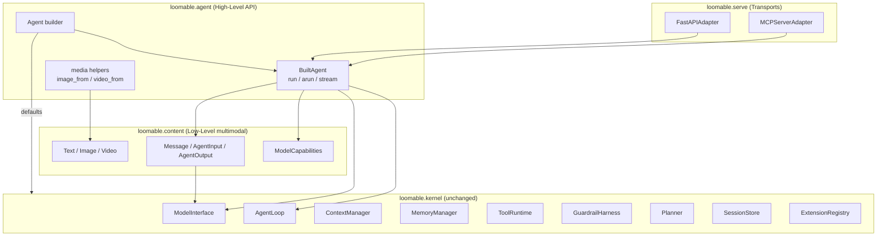
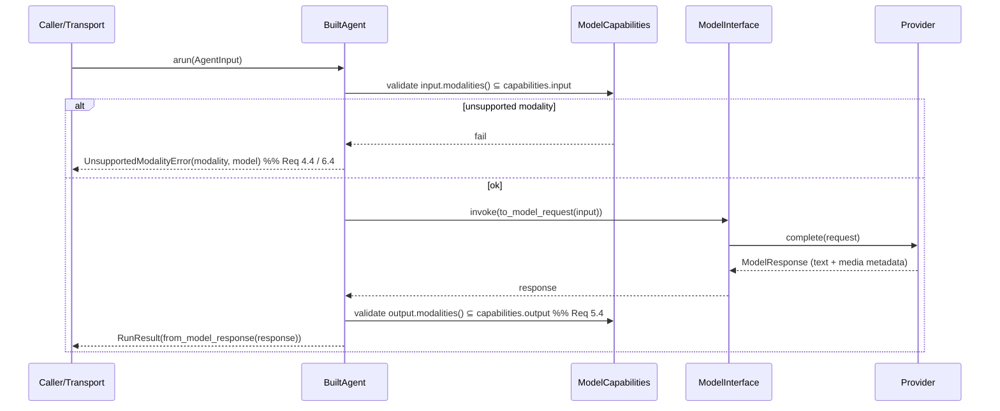
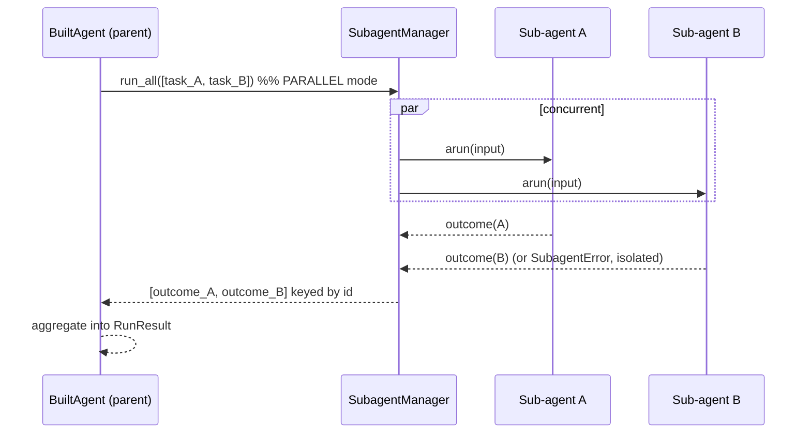

# Design Document: agent-api

## Overview

`agent-api` adds an ergonomic, agno-style **high-level API** on top of the stable `loomable` kernel, first-class **multimodal (text/image/video) input and output**, and two edge **transports** (FastAPI and MCP) that expose a built agent. It is an **additive layer** — the `loomable.kernel` package is not modified. New code lives in three new packages:

- `loomable.agent` — the high-level `Agent` builder and `Built_Agent` runtime wrapper, plus multimodal helpers.
- `loomable.content` — the low-level typed multimodal content model (`Text`, `Image`, `Video`, `Message`, `AgentInput`, `AgentOutput`) and `ModelCapabilities`.
- `loomable.serve` — the `FastAPIAdapter` and `MCPServerAdapter` edge transports.

The layering preserves the kernel + capabilities principle: the high-level API composes existing primitives (`AgentLoop`, `ModelInterface`, `ContextManager`, `MemoryManager`, `Summarizer`, `ToolRuntime`, `GuardrailHarness`, `Planner`, `SessionStore`, `ExtensionRegistry`), and the transports are thin request/response translators over a `Built_Agent`.

### Design Influences

- **agno ergonomics**: create an agent with a single constructor call and sensible defaults; `Agent(model=..., instructions=...).run("hi")`. Bells (memory, tools, sessions) are opt-in kwargs.
- **Multimodal as typed content**: model-agnostic content parts so that the same `AgentInput`/`AgentOutput` flow through in-process calls, FastAPI, and MCP unchanged. Media carry either inline bytes or a URI, never both empty.
- **Capability gating**: models declare `ModelCapabilities`; the agent validates modalities before hitting the provider so unsupported requests fail fast (no wasted calls).
- **Transport parity**: FastAPI and MCP adapters both wrap the *same* `Built_Agent`; they translate payloads and route sessions but hold no agent logic.

## Architecture

### High-Level Structure



### Layer Boundaries

- `loomable.content` depends only on stdlib + `loomable.kernel` models (for `ModelRequest`/`ModelResponse` mapping). No dependency on `agent` or `serve`.
- `loomable.agent` depends on `loomable.kernel` and `loomable.content`.
- `loomable.serve` depends on `loomable.agent` and `loomable.content`, plus FastAPI/MCP libraries.
- `loomable.kernel` depends on none of the above (invariant preserved; validated by a test).

## Components and Interfaces

### Multimodal Content Model (`loomable.content`) — Req 3, 4, 5, 6

```python
class Modality(Enum):
    TEXT = "text"; IMAGE = "image"; VIDEO = "video"

@dataclass(frozen=True)
class MediaPart:
    modality: Modality
    media_type: str                 # e.g. "image/png", "video/mp4", "text/plain"
    data: bytes | None = None       # inline payload
    uri: str | None = None          # external reference
    # __post_init__ enforces: exactly one of data/uri is set (Req 3.5);
    # modality must be consistent with media_type prefix (Req 3.6).

def Text(text: str) -> MediaPart: ...          # text/plain convenience
def Image(*, data=None, uri=None, media_type="image/png") -> MediaPart: ...
def Video(*, data=None, uri=None, media_type="video/mp4") -> MediaPart: ...

@dataclass
class Message:
    role: str                       # "user" | "assistant" | "system"
    parts: list[MediaPart]

@dataclass
class AgentInput:
    messages: list[Message]         # ordered; >= 1
    @classmethod
    def from_text(cls, text: str) -> "AgentInput": ...
    def modalities(self) -> set[Modality]: ...

@dataclass
class AgentOutput:
    parts: list[MediaPart]          # ordered; >= 1
    def text(self) -> str: ...      # concatenated text parts
    def modalities(self) -> set[Modality]: ...

@dataclass(frozen=True)
class ModelCapabilities:
    input: frozenset[Modality] = frozenset({Modality.TEXT})
    output: frozenset[Modality] = frozenset({Modality.TEXT})
```

**Kernel bridging.** `loomable.content` provides `to_model_request(agent_input, ...) -> ModelRequest` and `from_model_response(ModelResponse) -> AgentOutput`. The existing `ModelRequest.messages` is `list[dict]`; multimodal parts serialize to the provider-agnostic OpenAI-style content-array shape (`{"type": "image_url"/"input_text"/...}`). `ModelResponse.metadata["media"]` carries any returned non-text media so `from_model_response` can rebuild media parts; text maps from `ModelResponse.content` (Req 5.3).

**Invariants encoded:**
- A `MediaPart` has exactly one of `data`/`uri` (Req 3.5).
- `media_type` prefix must match `modality` (`image/*`↔IMAGE, `video/*`↔VIDEO, `text/*`↔TEXT) (Req 3.6).
- `AgentInput.messages` and `AgentOutput.parts` are non-empty.

### High-Level Agent Builder (`loomable.agent`) — Req 1, 2

```python
class Agent:
    def __init__(
        self,
        model: ModelProvider | ModelSpec,          # required (Req 1.1)
        *,
        instructions: str | None = None,
        tools: list[Tool] | None = None,
        skills: list[Path] | None = None,
        mcp_servers: list[MCPServerSpec] | None = None,
        capabilities: ModelCapabilities | None = None,   # Req 6.1/6.2 default text-only
        token_budget: int = 8192,
        checkpoint_interval: int = 5,
        session_id: str | None = None,
        # multi-agent orchestration (Req 11):
        sub_agents: list["Agent | BuiltAgent"] | None = None,
        mode: OrchestrationMode = OrchestrationMode.SINGLE,
        # knowledge / RAG (Req 16):
        retrievers: list[Retriever] | None = None,
        # tool hooks / HITL (Req 14):
        tool_hooks: list[ToolHook] | None = None,
        require_confirmation: list[str] | None = None,   # tool names needing approval
        # low-level overrides (Req 2.2/2.3):
        context_manager: ContextManager | None = None,
        memory: MemoryManager | None = None,
        tool_runtime: ToolRuntime | None = None,
        harness: GuardrailHarness | None = None,
        planner: Planner | None = None,
        session_store: SessionStore | None = None,
    ) -> None: ...

    def build(self) -> "BuiltAgent": ...           # validates config (Req 1.6)
    # output_schema enables structured output (Req 13)
    async def arun(self, input: AgentInput | str, *, output_schema: type | None = None) -> RunResult: ...
    def run(self, input: AgentInput | str, *, output_schema: type | None = None) -> RunResult: ...  # sync wrapper
    async def astream(self, input: AgentInput | str) -> AsyncIterator[RunChunk]: ...
```

The constructor builds nothing expensive; `build()` (called lazily on first run) constructs defaults for any subsystem not supplied (Req 1.2) and validates required fields, raising `AgentConfigError(field=...)` on problems (Req 1.6). Supplied primitives override defaults (Req 2.3). A bare string input is wrapped via `AgentInput.from_text`.

```python
@dataclass
class BuiltAgent:
    loop: AgentLoop
    model_interface: ModelInterface
    memory: MemoryManager
    tool_runtime: ToolRuntime
    session: Session
    capabilities: ModelCapabilities
    async def arun(self, input: AgentInput) -> RunResult: ...
    async def astream(self, input: AgentInput) -> AsyncIterator[RunChunk]: ...
    # read-only access to subsystems (Req 2.1)

@dataclass
class RunResult:
    output: AgentOutput
    session_id: str
    usage: dict[str, int]
    tool_activity: list[ToolOutcome]
```

**Media helpers (high-level, Req 4.2):**
```python
def image(path=None, *, data=None, uri=None, media_type="image/png") -> MediaPart: ...
def video(path=None, *, data=None, uri=None, media_type="video/mp4") -> MediaPart: ...
```
`path` reads bytes and infers `media_type` from the extension.

### Run Flow and Capability Gating — Req 4, 5, 6



Capability validation runs **before** provider invocation (Req 6.3/6.4). Output-modality validation guards a response whose media exceed declared output capabilities (Req 5.4).

### Multi-Agent Orchestration (`loomable.agent`) — Req 11

Inspired by agno teams (coordinate / route / broadcast) and LangChain deep-agent sub-agents (which read/search/summarize in parallel), the builder accepts `sub_agents` plus an `OrchestrationMode`. Parallel execution delegates to the existing kernel `SubagentManager.run_all()`, which already runs each child as a concurrent agent loop via `asyncio.gather(..., return_exceptions=True)` with per-child fault isolation and results keyed to the originating task — so no kernel change is needed (Req 11.8).

```python
class OrchestrationMode(Enum):
    SINGLE   = "single"     # no sub-agents; run this agent's own loop
    PARALLEL = "parallel"   # broadcast: every sub-agent runs concurrently on the input
    ROUTE    = "route"      # a router selects exactly one sub-agent
    COORDINATE = "coordinate"  # leader delegates, then synthesizes results

class Orchestrator:
    def __init__(self, sub_agents: list[BuiltAgent], mode: OrchestrationMode,
                 leader: BuiltAgent | None = None) -> None: ...
    async def run(self, input: AgentInput) -> RunResult: ...
```

Mode behavior:
- **PARALLEL** — wrap each sub-agent's `arun(input)` as a `DelegatedTask(task_id=<agent id>, agent_factory=...)` and call `SubagentManager.run_all()`. Returns a `RunResult` whose `tool_activity`/metadata carries each child `SubagentOutcome` keyed by sub-agent id; one child failure yields a `SubagentError` for that child while siblings still return (Req 11.2–11.5). Aggregated `AgentOutput` concatenates child outputs (order = sub-agent order).
- **ROUTE** — the leader (or a routing policy) selects one sub-agent; only that child runs (Req 11.6).
- **COORDINATE** — the leader plans, delegates to a chosen subset (possibly in parallel via the same primitive), then synthesizes a single `AgentOutput` (Req 11.7).



### Parallel Tool Calling (`loomable.agent`) — Req 12

When a step produces multiple independent tool calls, `BuiltAgent` dispatches them through the existing kernel `ToolRuntime.dispatch()`, which runs them concurrently and matches each `ToolOutcome` to its `tool_call_id` with fault isolation (Req 12.1–12.3). No kernel change (Req 12.4).

### Structured Output (`loomable.agent`) — Req 13

`arun(..., output_schema=SomeModel)` instructs the model (via request formatting) to return structured data, then parses/validates the text output against `output_schema` (a dataclass/`pydantic` model). On success `RunResult.output` carries the validated object (exposed via a `structured` field); on parse/validation failure a `StructuredOutputError` names the failure (Req 13.2/13.3). With no schema the output is returned unchanged (Req 13.4).

### Tool Hooks and Human-in-the-Loop (`loomable.agent`) — Req 14

`tool_hooks` are callables `(tool_name, call, args) -> decision`; pre-hooks run before dispatch and post-hooks after (Req 14.1/14.2). Rejection is expressed as a guardrail rule so the kernel `GuardrailHarness` blocks and records the call without executing it (Req 14.3, 14.5). `require_confirmation` tool names install a confirmation gate that pauses for an approval decision (via an injectable approver callback; default deny in headless mode) before executing (Req 14.4). This layers on the existing harness — no kernel change.

### Knowledge / Retriever Integration (`loomable.agent`) — Req 16

`retrievers=[...]` wraps each `Retriever` with the existing kernel `RetrieverTool` adapter and registers it in the `ToolRuntime`, so the agent invokes retrieval as a normal tool and Agentic RAG runs at the edge (Req 16.1–16.3). No kernel change (Req 16.4).

### Persistent Memory and Sessions (`loomable.agent`) — Req 15

The builder accepts `session_id`; `build()` either creates a new `Session` or resumes one via `SessionStore.resume()` (raising the kernel `SessionNotFoundError` for unknown ids, Req 15.4). After each run the `BuiltAgent` persists state via `SessionStore.save()` so prior turns are restored on resume (Req 15.2/15.3). Uses existing kernel stores unchanged.

### FastAPI Adapter (`loomable.serve`) — Req 7, 9

```python
class FastAPIAdapter:
    def __init__(self, agent: BuiltAgent) -> None: ...
    def app(self) -> FastAPI: ...     # builds routes
```

Routes:
- `POST /run` — body is a JSON `AgentInput` (multimodal parts as base64 `data` or `uri`); returns `RunResult` JSON (Req 7.2). Optional `session_id` routes to a session (Req 7.5).
- `POST /run/stream` — server-sent events / chunked streaming of `RunChunk`s (Req 7.3).
- `GET /health` — readiness (Req 7.4).
- Malformed payloads or unsupported modality → `400`/`422` with a descriptive message (Req 7.6). The adapter maps `UnsupportedModalityError` and validation errors to `400`.

The adapter holds no agent logic; it (de)serializes content and forwards to `BuiltAgent.arun/astream` (Req 9.3). Pydantic models mirror `AgentInput`/`RunResult` for request/response schemas.

### MCP Server Adapter (`loomable.serve`) — Req 8, 9

```python
class MCPServerAdapter:
    def __init__(self, agent: BuiltAgent, tool_name: str = "run_agent") -> None: ...
    def server(self): ...             # returns an MCP server object
    async def serve_stdio(self) -> None: ...
```

On connect it advertises a single tool (default `run_agent`) whose input schema accepts an `AgentInput` (text plus optional media) (Req 8.2). Invoking the tool runs `BuiltAgent.arun` and maps `AgentOutput` parts to MCP content items — text as text content, image/video as MCP media/embedded-resource content (Req 8.3/8.4). Failures return an MCP error result identifying the failure (Req 8.5).

### Transport Parity — Req 9

Both adapters accept a `BuiltAgent` and call the identical `arun/astream` methods, so the same kernel `AgentLoop` executes regardless of transport. A parity test drives one `BuiltAgent` in-process, via a FastAPI `TestClient`, and via a direct `MCPServerAdapter` tool call, asserting equivalent outputs for equivalent inputs.

## Data Models

```python
@dataclass
class ModelSpec:                      # declarative model config for the builder
    provider: str
    provider_impl: ModelProvider | None = None
    capabilities: ModelCapabilities = ModelCapabilities()

@dataclass
class RunChunk:
    delta: MediaPart                  # incremental output part (usually text)
    done: bool = False

@dataclass
class RunResult:                       # extended for orchestration + structured output
    output: AgentOutput
    session_id: str
    usage: dict[str, int]
    tool_activity: list[ToolOutcome]
    sub_results: dict[str, "RunResult | SubagentError"] | None = None  # Req 11.4/11.5
    structured: object | None = None                                    # Req 13.2

ToolHook = Callable[[str, ToolCall, dict], object]   # (tool_name, call, args) -> decision

class AgentConfigError(LoomableError):     # Req 1.6
    def __init__(self, field: str): ...

class UnsupportedModalityError(LoomableError):   # Req 4.4, 5.4, 6.4
    def __init__(self, modality: str, model: str): ...

class StructuredOutputError(LoomableError):      # Req 13.3
    def __init__(self, reason: str): ...
```

`LoomableError` is the existing kernel base error, reused for consistency (no kernel change — it is imported, not modified).

## Correctness Properties

*A property is a characteristic that should hold across all valid executions.* Each is intended as a single property-based test (min. 100 iterations) unless noted as a unit/integration test.

### Property 1: Media part exclusivity
*For any* attempt to build a `MediaPart`, construction SHALL succeed iff exactly one of `data`/`uri` is provided; otherwise it SHALL raise a validation error. **Validates: Requirements 3.5**

### Property 2: Modality / media-type consistency
*For any* `MediaPart`, construction SHALL succeed iff the `media_type` prefix matches the declared `modality`. **Validates: Requirements 3.6**

### Property 3: Input round-trip through the model request
*For any* `AgentInput` of text/image/video parts, `from_model_request(to_model_request(input))`-equivalent reconstruction SHALL preserve the ordered modalities and payload references. **Validates: Requirements 3.3, 4.3, 4.5**

### Property 4: Output round-trip through the model response
*For any* `ModelResponse` carrying text and/or media, `from_model_response` SHALL yield an `AgentOutput` whose ordered parts reflect the response; a text-only response SHALL yield exactly one text part. **Validates: Requirements 5.2, 5.3, 5.5**

### Property 5: Builder defaults produce a runnable agent
*For any* minimal config (model only), `Agent(...).build()` SHALL produce a `BuiltAgent` with non-null loop, model interface, memory, tool runtime, and session. **Validates: Requirements 1.1, 1.2**

### Property 6: Overrides win over defaults
*For any* subsystem primitive supplied to the builder, the `BuiltAgent` SHALL use that exact instance rather than a constructed default. **Validates: Requirements 2.2, 2.3**

### Property 7: Capability gating on input
*For any* `AgentInput` whose modalities are not a subset of the model's declared input capabilities, `arun` SHALL raise `UnsupportedModalityError(modality, model)` without invoking the provider. **Validates: Requirements 4.4, 6.3, 6.4**

### Property 8: Capability gating on output
*For any* model response whose media modalities exceed declared output capabilities, `arun` SHALL raise `UnsupportedModalityError(modality, model)`. **Validates: Requirements 5.4**

### Property 9: Default capabilities are text-only
*For any* model configured without `ModelCapabilities`, the effective capabilities SHALL be text input and text output. **Validates: Requirements 6.2**

### Property 10: Missing-field validation
*For any* builder configuration missing a required field, `build()` SHALL raise `AgentConfigError` naming the field before any run. **Validates: Requirements 1.6**

### Property 11: FastAPI run maps to a Run_Result
*For any* well-formed `AgentInput` posted to `/run`, the adapter SHALL return a body reconstructable into an equal `RunResult`; malformed or unsupported-modality payloads SHALL yield a 4xx naming the problem. **Validates: Requirements 7.2, 7.6** (integration)

### Property 12: FastAPI session routing
*For any* two sequential `/run` calls with the same `session_id`, the second run SHALL observe session state persisted by the first. **Validates: Requirements 7.5** (integration)

### Property 13: MCP tool advertises and runs the agent
*For any* MCP connection, the adapter SHALL advertise a run tool; invoking it with an `AgentInput` SHALL return the `AgentOutput` mapped to MCP content, with media parts represented per MCP conventions. **Validates: Requirements 8.2, 8.3, 8.4** (integration)

### Property 14: MCP failure surfaces an error result
*For any* invocation that raises inside the agent, the MCP adapter SHALL return an error result identifying the failure rather than raising through the transport. **Validates: Requirements 8.5** (integration)

### Property 15: Transport parity
*For any* `BuiltAgent` and equivalent `AgentInput`, in-process `arun`, the FastAPI `/run`, and the MCP run tool SHALL produce equivalent `AgentOutput`. **Validates: Requirements 9.1, 9.2** (integration)

### Property 16: Kernel remains independent
The `loomable.kernel` package tree SHALL import no module from `loomable.agent`, `loomable.content`, or `loomable.serve`. **Validates: Requirements 1.7, 2.4, 7.7, 8.6, 10.3** (unit)

### Property 17: Parallel sub-agents execute concurrently
*For any* set of Sub_Agents instrumented with artificial delays, running a Built_Agent in PARALLEL mode SHALL return an outcome for every Sub_Agent and the total wall-clock time SHALL be less than the sum of the individual delays (demonstrating concurrent execution). **Validates: Requirements 11.2, 11.3**

### Property 18: Sub-agent results keyed with fault isolation
*For any* set of Sub_Agents in which an arbitrary subset is designated to fail, PARALLEL execution SHALL return exactly one result per Sub_Agent keyed to its id, a failure (naming it) for each failing Sub_Agent, and a successful result for every non-failing Sub_Agent. **Validates: Requirements 11.4, 11.5**

### Property 19: Route mode runs exactly one sub-agent
*For any* routing decision over a set of Sub_Agents, ROUTE mode SHALL execute exactly one Sub_Agent (the selected one) and no others. **Validates: Requirements 11.6**

### Property 20: Parallel tool calls complete with matching and isolation
*For any* set of independent tool calls with distinct ids in one step, the Built_Agent SHALL return exactly one outcome per id matched to its originating call, with a single failure isolated from succeeding siblings. **Validates: Requirements 12.1, 12.2, 12.3**

### Property 21: Structured output validates against the schema
*For any* output schema and a model response, `arun(output_schema=S)` SHALL return a `RunResult.structured` validated against `S` when the response conforms, and SHALL raise `StructuredOutputError` when it does not; with no schema the output SHALL be unchanged. **Validates: Requirements 13.2, 13.3, 13.4**

### Property 22: Tool pre-hook rejection blocks execution
*For any* tool call rejected by a pre-hook, the Built_Agent SHALL not execute the tool and SHALL record the rejection, while non-rejected calls SHALL execute. **Validates: Requirements 14.2, 14.3**

### Property 23: Confirmation gate blocks unapproved tools
*For any* tool configured to require confirmation, the Built_Agent SHALL execute it if and only if an approval decision is granted. **Validates: Requirements 14.4**

### Property 24: Session persistence round-trip via the builder
*For any* Built_Agent run with a session id, resuming that id SHALL restore prior turns; resuming an unknown id SHALL raise a not-found error naming the id. **Validates: Requirements 15.2, 15.3, 15.4** (integration)

### Property 25: Attached retriever is invocable as a tool
*For any* Retriever attached through the builder, the Built_Agent SHALL expose it as an invocable tool whose invocation returns the retrieved content. **Validates: Requirements 16.2, 16.3**

## Error Handling

| Error | Raised when | Carries |
|---|---|---|
| `AgentConfigError` | Builder config missing/invalid required field (Req 1.6) | field name |
| `UnsupportedModalityError` | Input/output modality not in model capabilities (Req 4.4, 5.4, 6.4) | modality, model |
| `MediaPartError` (ValueError subclass) | Media part built with both/neither payload, or modality/type mismatch (Req 3.5, 3.6) | reason |
| FastAPI `400/422` | Malformed payload / unsupported modality (Req 7.6) | descriptive message |
| MCP error result | Agent invocation failure over MCP (Req 8.5) | failure description |

Isolation principles: capability validation happens before provider calls (fail fast, no side effects). Transport adapters catch domain errors and translate them into transport-appropriate error shapes (HTTP status, MCP error result) rather than leaking stack traces.

## Testing Strategy

- **Property/unit tests** for the content model, builder defaults/overrides, and capability gating (Properties 1–10, 16), using `hypothesis` (min. 100 examples), providers mocked.
- **Integration tests** for FastAPI (via `TestClient`), MCP (via a direct in-process tool call / mock client), and transport parity (Properties 11–15).
- Tests run once via `uv run pytest`. New dependencies (`fastapi`, an ASGI test client, MCP server support) added via uv. `loomable.kernel` is never modified.
