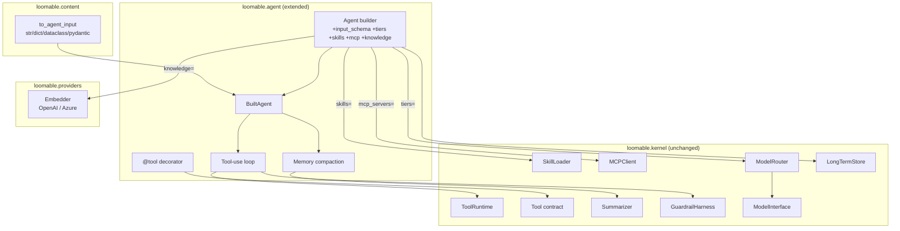
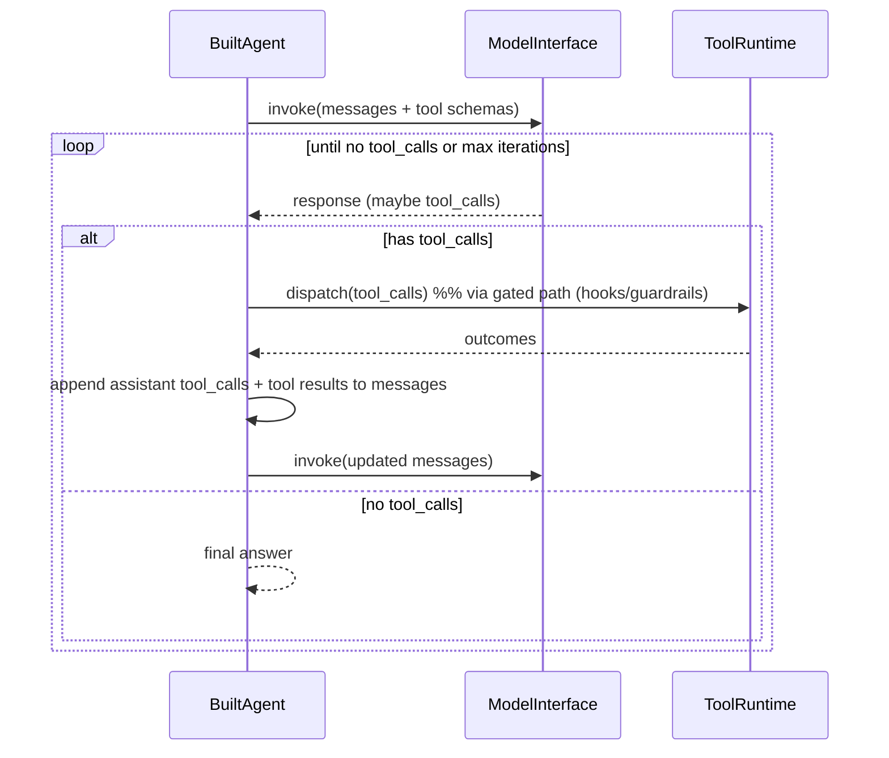

# Design Document: agent-ergonomics

## Overview

`agent-ergonomics` adds high-leverage convenience to the `loomable.agent` layer while keeping the framework trimmed: every capability is **additive** and **reuses an existing kernel primitive**; `loomable.kernel` is never modified (enforced by an import-independence test). The feature spans three existing edge packages plus one new module:

- `loomable.content` — extend input coercion (`to_agent_input`) to accept Pydantic models / dataclasses / dicts (already partially present).
- `loomable.agent` — the `Agent` builder gains `input_schema`, function-tool support, an **automatic tool-use loop**, wired `skills=` / `mcp_servers=`, automatic **memory compaction**, tiered **routing**, and `knowledge=`. A new `loomable/agent/tools.py` holds the `@tool` decorator.
- `loomable.providers` — a new `Embedder` protocol with `OpenAIEmbedder` / `AzureOpenAIEmbedder`.

The design reuses these kernel primitives unchanged: `ToolRuntime` (tool dispatch), `Tool` (contract), `SkillLoader` (skills), `MCPClient` (MCP), `Summarizer` (compaction), `ModelRouter` (tiers), `LongTermStore` (knowledge), and the existing `ModelInterface`/`GuardrailHarness`.

### Design Influences

- **agno flexible input** — agents accept strings, dicts, messages, and Pydantic models; `input_schema` validates before running. loomable mirrors this via `to_agent_input` + an optional `input_schema` on the builder.
- **agno/langchain function tools** — a decorator that turns a typed function into a tool with an auto JSON schema is the ergonomic norm; loomable adds `@tool` over the kernel `Tool` contract.
- **Tool-calling loop** — the standard "LLM calling tools in a loop" is the core agent behavior; loomable runs it in the high-level layer atop `ToolRuntime`, keeping the kernel loop generic.
- **Context engineering** — bounded context via windowing + checkpoint summarization is the accepted way to survive long horizons; loomable reuses the kernel `Summarizer`.

## Architecture



## Components and Interfaces

### Flexible input + input_schema (`loomable.content`, `loomable.agent`) — Req 1

`loomable.content.to_agent_input(value)` already coerces `AgentInput | str | BaseModel | dataclass | dict` into an `AgentInput` (structured values are serialized to JSON as the user message). The builder adds validation:

```python
class Agent:
    def __init__(self, ..., input_schema: type | None = None): ...

@dataclass
class BuiltAgent:
    input_schema: type | None = None
    def _coerce_input(self, value) -> AgentInput:
        if self.input_schema is not None and not isinstance(value, str):
            value = self._validate_against_schema(value)   # dict/model -> validated model
        return to_agent_input(value)
```

- Strings and `AgentInput` bypass schema (Req 1.3/1.6). A dict/model is validated/coerced into `input_schema` (Pydantic `model_validate`, or dataclass construction); failure raises `InputValidationError` naming the reason before any model call (Req 1.4/1.5). `arun`/`run`/`astream` call `_coerce_input` instead of the old inline string check.

### Function tools via `@tool` (`loomable/agent/tools.py`) — Req 2

```python
def tool(fn=None, *, name: str | None = None, description: str | None = None) -> Tool | Callable:
    """Turn a plain function into a Tool with an auto-derived JSON schema."""

class FunctionTool(Tool):
    name: str
    description: str
    parameters: dict          # JSON schema derived from the signature
    async def invoke(self, args: dict) -> ToolResult: ...
```

- `name` defaults to `fn.__name__`, `description` to the docstring (overridable) (Req 2.2).
- `parameters` is a JSON schema built from the signature: each parameter becomes a property whose type maps from its annotation (`str`→string, `int`→integer, `float`→number, `bool`→boolean, `list`→array, `dict`→object, default→string); parameters without defaults are `required` (Req 2.3).
- `invoke(args)` binds `args` to the function and calls it; async functions are awaited, sync functions run in a thread (`asyncio.to_thread`) (Req 2.4/2.5). Exceptions are caught and returned as a `ToolResult` error naming the tool (Req 2.6).

### Automatic tool-use loop (`loomable/agent/builder.py`) — Req 3

The current `_run_single` makes one model call. A new `_run_tool_loop` wraps it: it advertises tool schemas to the model, and while the model returns tool calls it dispatches them (through the gated path so hooks/guardrails apply) and appends the results as messages, repeating up to `max_tool_iterations`.



- Enabled when the agent has any tools in its `ToolRuntime`; otherwise `arun` uses the single-shot path unchanged (Req 3.6). Tool schemas come from `FunctionTool.parameters` (or a generic schema for other tools) and are passed via `ModelRequest.tools`.
- Executed tool outcomes are collected into `RunResult.tool_activity` (Req 3.4). Dispatch reuses the kernel `ToolRuntime` via the existing gated path so tool hooks and guardrails apply (Req 3.5/3.7). A `max_tool_iterations` (default 6) bounds the loop (Req 3.2).

### Skills wired in (`loomable/agent/builder.py`) — Req 4

`Agent(skills=[Path(...), ...])`. On `build()`, `_build_tool_registry` also runs the kernel `SkillLoader`: `discover(roots)` then `load(manifest)` per skill, registering each loaded skill's script tools by name. A failing skill is isolated — it yields a `SkillLoadError` captured per-skill (logged/collected) while others load (Req 4.3). No kernel change (Req 4.4).

### MCP servers wired in (`loomable/agent/builder.py`) — Req 5

`Agent(mcp_servers=[spec, ...])`. On `build()` (or lazily on first use), the kernel `MCPClient` connects to each server and enumerates tools; each MCP tool is registered as a `Tool` whose `invoke` calls `MCPClient.call_tool`. A failed connection yields `MCPConnectionError` for that server while others proceed (Req 5.3). No kernel change (Req 5.4).

### Automatic memory compaction (`loomable/agent/builder.py`) — Req 6

The agent already records turns into `session.l1` and injects a windowed slice. Compaction adds: when `len(session.l1)` exceeds a `compaction_threshold` (default e.g. 2× the window), the oldest turns beyond the retained window are summarized by the kernel `Summarizer` into a `StructuredSummary`, stored in `session.l2`, and dropped from `session.l1`. `_memory_prefix` then prepends the L2 summaries (as system/context messages) ahead of the retained recent turns (Req 6.1–6.4). Reuses `Summarizer` (Req 6.5).

### Tiered routing (`loomable/agent/builder.py`) — Req 7

`Agent(tiers={...}, tier_policy=..., fallback_tiers={...})`. When tiers are supplied, `build()` constructs a kernel `ModelRouter` over the `ModelInterface`, and `_run_single`/`_run_tool_loop` route via `router.route(request)` instead of `model_interface.invoke`, recording any `TierSubstitution` in `RunResult` metadata (Req 7.1–7.3). With no tiers, the single provider is used unchanged (Req 7.4). Reuses `ModelRouter` (Req 7.5).

### Embedders + knowledge (`loomable.providers`, `loomable/agent/builder.py`) — Req 8

```python
class Embedder(Protocol):
    async def embed(self, text: str) -> list[float]: ...

class OpenAIEmbedder:  ...   # base_url + model, OpenAI-compatible /embeddings
class AzureOpenAIEmbedder: ...   # deployment + api-version
```

`Agent(knowledge=[str, ...], embedder=...)`. On `build()`, each knowledge document is embedded and indexed into a `LongTermStore` (Req 8.2). At run time, the agent embeds the input, recalls top-k via `LongTermStore.query`, and prepends the retrieved snippets as context (Req 8.3). An unavailable embedder raises an error naming it (Req 8.4). Reuses `LongTermStore` (Req 8.5).

## Data Models

```python
# tools.py
class FunctionTool(Tool):
    name: str; description: str; parameters: dict; _fn: Callable

# builder additions
@dataclass
class BuiltAgent:
    # ... existing fields ...
    input_schema: type | None = None
    max_tool_iterations: int = 6
    compaction_threshold: int = 16
    router: "ModelRouter | None" = None
    long_term: "LongTermStore | None" = None
    embedder: "Embedder | None" = None

class InputValidationError(LoomableError):   # Req 1.5
    def __init__(self, reason: str): ...
```

`InputValidationError` is added to `loomable/agent/errors.py`; all new errors subclass the existing kernel `LoomableError` (imported, not modified).

## Correctness Properties

*A property is a characteristic that should hold across all valid executions.* Each is intended as a single test (property-based where a quantifier is natural), min. 100 iterations for PBTs; integration tests are noted.

### Property 1: Structured input is serialized and passed through
*For any* Pydantic model, dataclass, or dict input, the coerced `AgentInput` SHALL be a single user message whose text is the JSON serialization of the value; strings and `AgentInput` values pass through unchanged. **Validates: Requirements 1.1, 1.2, 1.3**

### Property 2: Input schema validation gates the run
*For any* input and a configured `input_schema`, a dict/model that conforms SHALL be accepted (validated into the schema), and a non-conforming dict/model SHALL raise `InputValidationError` before any model call; a plain string SHALL bypass validation. **Validates: Requirements 1.4, 1.5, 1.6**

### Property 3: Decorated function becomes an invocable tool
*For any* decorated function, `@tool` SHALL produce a `Tool` whose name/description reflect the function (or overrides) and whose invocation with valid args returns a `ToolResult` derived from the function's return value, for both sync and async functions. **Validates: Requirements 2.1, 2.2, 2.4, 2.5**

### Property 4: Derived tool schema matches the signature
*For any* function with annotated parameters, the derived JSON schema SHALL contain one property per parameter with a type mapped from its annotation, and SHALL mark exactly the parameters without defaults as required. **Validates: Requirements 2.3**

### Property 5: Function tool errors are isolated and named
*For any* decorated function that raises, invoking the tool SHALL return a tool error identifying the tool rather than propagating the exception. **Validates: Requirements 2.6**

### Property 6: Tool-use loop runs tools and terminates
*For any* scripted sequence of model responses that request tool calls then stop, the loop SHALL dispatch each requested tool call, feed results back, and terminate with the final no-tool response as output, executing exactly the requested calls. **Validates: Requirements 3.1, 3.2, 3.3**

### Property 7: Tool activity is recorded
*For any* run that executes tool calls, the returned tool activity SHALL contain one entry per executed tool call. **Validates: Requirements 3.4**

### Property 8: No tool calls means single-shot
*For any* model response with no tool calls, the agent SHALL make exactly one model call and return its output (no extra iterations). **Validates: Requirements 3.6**

### Property 9: Loop honors hooks/guardrails
*For any* tool call blocked by a configured guardrail or pre-hook, the loop SHALL not execute that call and SHALL record it as blocked, while non-blocked calls execute. **Validates: Requirements 3.5**

### Property 10: Skills register their script tools with isolation
*For any* set of Skills of which an arbitrary subset fails to load, building the agent SHALL register the script tools of every loadable Skill and SHALL report a `SkillLoadError` for each failing Skill without aborting the others. **Validates: Requirements 4.1, 4.2, 4.3**

### Property 11: MCP tools are exposed with isolation
*For any* set of MCP servers of which an arbitrary subset fails to connect, building the agent SHALL expose the tools of every connected server and SHALL report an `MCPConnectionError` for each failed server without aborting the others. **Validates: Requirements 5.1, 5.2, 5.3** (integration)

### Property 12: Compaction summarizes overflow and preserves recent turns
*For any* conversation exceeding the compaction threshold, after a run the retained raw turns SHALL be at most the window size, a summary SHALL be stored in L2 covering the compacted turns, and the compacted raw turns SHALL no longer be present. **Validates: Requirements 6.1, 6.2, 6.3, 6.4**

### Property 13: Tier routing selects and falls back
*For any* configured tier policy, the router SHALL select a configured tier per call; and when the selected tier is unavailable but a fallback exists, the call SHALL route to the fallback and a tier substitution SHALL be recorded. **Validates: Requirements 7.1, 7.2, 7.3**

### Property 14: No tiers means unchanged single model
*For any* agent built without a tier configuration, model calls SHALL use the single configured provider unchanged. **Validates: Requirements 7.4**

### Property 15: Embedder round-trip and unavailability
*For any* text, a built-in Embedder SHALL return a numeric vector via its endpoint, and an unavailable Embedder SHALL raise an error identifying it. **Validates: Requirements 8.1, 8.4**

### Property 16: Attached knowledge is indexed and recalled
*For any* set of knowledge documents and a query relevant to one of them, building indexes each document and a run SHALL recall the relevant document and include it in the model context. **Validates: Requirements 8.2, 8.3, 8.5** (integration)

### Property 17: Kernel remains independent
The `loomable.kernel` package tree SHALL import no module from `loomable.agent`, `loomable.content`, `loomable.serve`, or `loomable.providers`. **Validates: Requirements 9.2, 9.3**

## Error Handling

| Error | Raised when | Carries |
|---|---|---|
| `InputValidationError` | Dict/model input fails `input_schema` validation (Req 1.5) | reason |
| `ToolError` (existing) | Function tool invocation raises (Req 2.6) | message, tool name |
| `SkillLoadError` (kernel) | A Skill fails to load (Req 4.3) | skill name |
| `MCPConnectionError` (kernel) | An MCP server fails to connect (Req 5.3) | server id |
| `ModelProviderError` (kernel) | Embedder/model endpoint unavailable (Req 8.4) | provider/embedder id |

Isolation principles: input validation happens before any model call; skill/MCP failures are per-unit isolated so a bad extension never aborts the agent; the tool-use loop routes dispatch through the existing gated path so guardrails/hooks are always applied.

## Testing Strategy

- **Unit / property tests** for input coercion + schema (Properties 1–2), the `@tool` decorator + schema derivation (3–5), the tool-use loop with a scripted provider (6–9), compaction (12), routing (13–14), and embedder behavior with mocked HTTP (15), plus the kernel-independence test (17). Use `hypothesis` (min. 100 examples) where a quantifier is natural; providers/HTTP/MCP mocked.
- **Integration tests** for skills registration (10), MCP tool exposure (11), and knowledge recall (16).
- Tests run once via `uv run pytest`. New dependencies (if any) added via uv. `loomable.kernel` is never modified.
