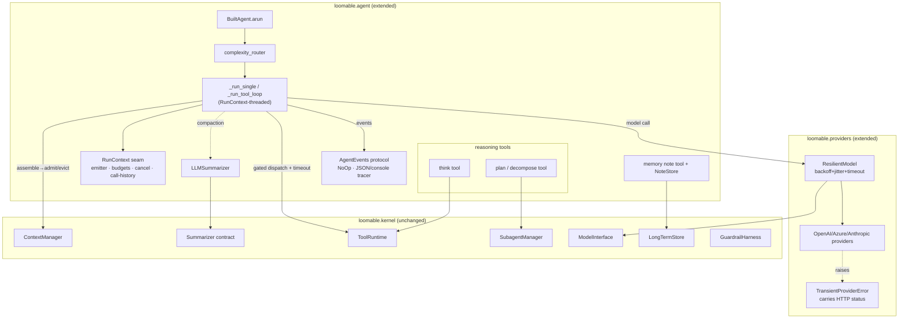
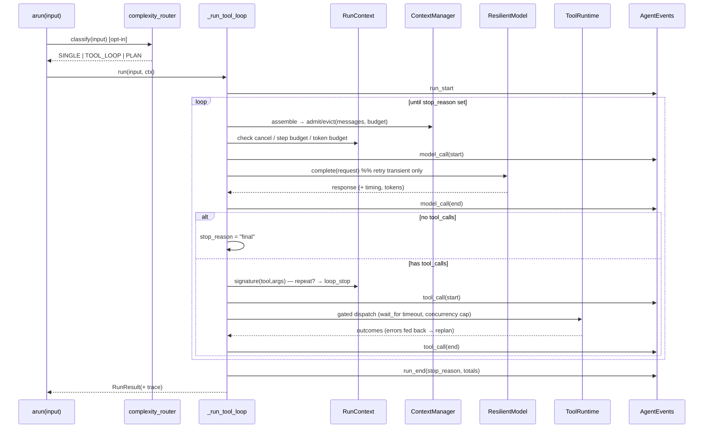

# Design Document: agent-harness

## Overview

`agent-harness` hardens the `loomable.agent` run path for production without touching the kernel. Today `BuiltAgent.arun` runs a clean ReAct loop (`_run_single` / `_run_tool_loop`) but has no transport resilience, no model-based summarization, no scratchpad/plan escalation at runtime, no structured observability, and it constructs a kernel `AgentLoop` in `build()` that the high-level path never actually runs. This feature closes all five gaps.

Everything is **additive** and lives in the edge layers (`loomable.agent`, `loomable.providers`, plus small new edge modules). `loomable.kernel` is never modified — the existing import-independence test (`tests/unit/test_kernel_independence.py`) must keep passing. New errors subclass the kernel `LoomableError` / `ModelProviderError` from the edge. The framework stays lean: no mandatory OpenTelemetry, `tenacity`, or heavy deps; retries/backoff/jitter use `asyncio` + `random` from stdlib, and observability ships a no-op default with an optional JSON/console tracer. OTel GenAI semantic conventions are **mapped**, not depended on.

The whole feature is unified by **one new seam — `RunContext`** — threaded through `_run_single` / `_run_tool_loop`. It carries an event emitter, a step + token budget, a cooperative cancel flag, and a tool-call-signature history. Tracing (D), loop-detection and budgets (A), and cancellation all read from it. Adding the seam once keeps every workstream small.

### Design principles (2025–2026 best practice)

- **Replan, don't retry.** Transport-level retry (backoff + jitter) applies **only** to model calls, never blind-retries tools. Tool errors are already surfaced as `ToolResult.error` / `ToolOutcome.error` and fed back to the model so it can replan. Side-effecting tools are never blind-retried (idempotency awareness). *(Anthropic tool-use guidance; Temporal/idempotency practice.)*
- **Backoff + jitter for transient transport only.** Retry classifies on HTTP status: 429, 5xx, timeouts, and connection resets are transient; 4xx / auth / content-policy fail fast.
- **Compaction + structured note-taking + sub-agents** for long-horizon work. `LLMSummarizer` compacts; a `NoteStore`-backed `memory` tool gives durable, deduplicated notes; `AutoPlan`/`SubagentManager` fan out on demand. *(Anthropic context engineering.)*
- **Rolling window + pinned facts** so precise values aren't summarized into vagueness.
- **Scratchpad reasoning** (`think` tool) improves policy adherence over long tool chains. *(Anthropic "think" tool / agno reasoning tools.)*
- **Default to a loop, escalate to a graph only on complexity signals; every graph node is still a loop.** The `complexity_router` picks single-shot / tool-loop / plan; `plan`/`decompose` escalates at runtime. *(LangGraph / agno / LangChain consensus.)*
- **Observability standards to map to, not depend on:** OpenTelemetry GenAI semantic conventions + OpenInference.

The explicit goal: match or beat LangGraph / agno / LangChain on production-readiness while staying lean and fast.

### Reused kernel primitives (unchanged)

`ContextManager` (token budget, evict-then-admit), `Summarizer` (the `.summarize()` contract `LLMSummarizer` mirrors), `MemoryManager` / `LongTermStore` (notes backend), `ToolRuntime` (gated dispatch), `SubagentManager` (plan fan-out), `ModelInterface` / `ModelRouter`, `GuardrailHarness`, and the `Tool` contract / `FunctionTool`.

---

## Architecture



### End-to-end run flow



---

## Components and Interfaces

The feature is composed of one unifying seam (`RunContext`) plus five workstreams (A–E), each a component with concrete interfaces and function signatures. `RunContext` is described first because every workstream reads from it; the workstreams follow.

### The unifying seam: `RunContext`

A single object threaded through the run path. It is created by `arun` (or the run wrappers), passed into `_run_single` / `_run_tool_loop`, and read by every workstream. It is edge-only and never enters the kernel.

```python
# loomable/agent/context.py  (new edge module — note: NOT the kernel ContextManager)
from __future__ import annotations
import time
from dataclasses import dataclass, field
from .events import AgentEvents, NoOpEvents

@dataclass
class StopReason:
    """Why the loop terminated. `kind` is one of the STOP_* constants."""
    FINAL = "final"                     # model returned no tool calls
    MAX_ITERATIONS = "max_iterations"   # hit max_tool_iterations
    LOOP_DETECTED = "loop_detected"     # N identical (tool,args) repeats
    CANCELLED = "cancelled"             # cooperative cancel flag set
    STEP_BUDGET = "step_budget"         # step budget exhausted
    TOKEN_BUDGET = "token_budget"       # token budget exhausted
    ERROR = "error"                     # unrecoverable provider error
    kind: str
    detail: str = ""

@dataclass
class RunContext:
    """Per-run control + observability seam threaded through the run path.

    Threaded once through _run_single/_run_tool_loop; tracing, loop-detection,
    budgets, and cancellation all read from it. Kept out of the kernel entirely.
    """
    events: AgentEvents = field(default_factory=NoOpEvents)
    max_steps: int = 6                       # loop-iteration budget (mirrors max_tool_iterations)
    token_budget: int | None = None          # None = unbounded (delegated to ContextManager)
    loop_repeat_threshold: int = 3            # N identical signatures ⇒ short-circuit
    _cancelled: bool = field(default=False, init=False)
    _steps_used: int = field(default=0, init=False)
    _tokens_used: int = field(default=0, init=False)
    _call_history: dict[str, int] = field(default_factory=dict, init=False)  # signature -> count
    _t0: float = field(default_factory=time.monotonic, init=False)

    # --- cancellation (cooperative) ---
    def cancel(self) -> None: ...            # set the flag; checked at each loop boundary
    @property
    def cancelled(self) -> bool: ...

    # --- budgets ---
    def tick_step(self) -> bool: ...         # increment; return True while within max_steps
    def add_tokens(self, n: int) -> None: ...
    def token_budget_exceeded(self) -> bool: ...

    # --- loop / no-progress detection ---
    def record_call(self, tool_name: str, args: dict) -> int:
        """Hash (tool_name, canonicalized args), bump its count, return new count."""
    def is_looping(self, tool_name: str, args: dict) -> bool:
        """True when the signature count would reach loop_repeat_threshold."""

    # --- timing ---
    def elapsed(self) -> float: ...
```

`_signature(tool_name, args)` canonicalizes args with `json.dumps(args, sort_keys=True, default=str)` and hashes `f"{tool_name}:{canonical}"` with `hashlib.sha1`. Identical repeated side-effect-free calls are the loop signal.

**Threading.** `arun` builds a `RunContext` (from builder config + optional per-call overrides), passes it to the mode router, and each of `_run_single` / `_run_tool_loop` / `AutoPlan` accepts an optional `ctx: RunContext | None = None` (defaulting to a fresh no-op context so existing callers/tests are unaffected).

---

### Workstream A — Resilience (`loomable.providers`, tool dispatch)

### A.1 `TransientProviderError` (edge, subclass of kernel `ModelProviderError`)

Providers currently collapse every `httpx.HTTPError` into a bare `ModelProviderError(provider_id)`, losing the HTTP status. We enrich them to raise a status-carrying subclass so `ResilientModel` can classify.

```python
# loomable/providers/errors.py  (new)
from loomable.kernel.errors import ModelProviderError

class TransientProviderError(ModelProviderError):
    """A provider failure that MAY succeed on retry (429, 5xx, timeout, conn reset).

    Subclasses the kernel error so existing `except ModelProviderError` sites keep
    working; adds `status_code` (None for timeouts/connection errors) and `retry_after`.
    """
    def __init__(self, provider_id: str, *, status_code: int | None = None,
                 retry_after: float | None = None) -> None:
        self.status_code = status_code
        self.retry_after = retry_after          # parsed from Retry-After header when present
        super().__init__(provider_id)

class PermanentProviderError(ModelProviderError):
    """A provider failure that will NOT succeed on retry (4xx, auth, content policy)."""
    def __init__(self, provider_id: str, *, status_code: int | None = None) -> None:
        self.status_code = status_code
        super().__init__(provider_id)
```

Provider `complete()` changes (OpenAI/Azure/Anthropic), minimal and mechanical — classify before wrapping:

```python
def _classify_http_error(provider_id: str, exc: httpx.HTTPError) -> ModelProviderError:
    """Map an httpx error to a Transient/Permanent provider error carrying status."""
    if isinstance(exc, (httpx.TimeoutException, httpx.ConnectError, httpx.ReadError,
                        httpx.RemoteProtocolError)):
        return TransientProviderError(provider_id, status_code=None)
    if isinstance(exc, httpx.HTTPStatusError):
        code = exc.response.status_code
        if code == 429 or 500 <= code < 600:
            retry_after = _parse_retry_after(exc.response.headers.get("retry-after"))
            return TransientProviderError(provider_id, status_code=code, retry_after=retry_after)
        return PermanentProviderError(provider_id, status_code=code)   # 4xx / auth / policy
    return TransientProviderError(provider_id, status_code=None)       # unknown network error
```

`ModelProviderError` stays the base, so callers that catch it (and the kernel) are unaffected.

### A.2 `ResilientModel` wrapper

```python
# loomable/providers/resilient.py  (new)
from dataclasses import dataclass
from loomable.kernel.models import ModelRequest, ModelResponse
from loomable.kernel.contracts import ModelProvider

@dataclass
class RetryPolicy:
    max_attempts: int = 3            # total tries (1 initial + 2 retries)
    base_delay: float = 0.5          # seconds
    max_delay: float = 20.0
    multiplier: float = 2.0          # exponential factor
    jitter: float = 0.5             # full-jitter fraction in [0, jitter*delay]
    per_call_timeout: float = 60.0   # asyncio.wait_for around each attempt

class ResilientModel:
    """Wraps a ModelProvider, adding per-call timeout + backoff-with-jitter retry.

    Retries ONLY transient errors (TransientProviderError / timeout). Fails fast on
    PermanentProviderError (4xx/auth/policy). This is transport resilience for MODEL
    CALLS ONLY — it never touches tools (replan, don't retry).
    """
    def __init__(self, inner: ModelProvider, policy: RetryPolicy | None = None,
                 events: "AgentEvents | None" = None) -> None: ...

    async def complete(self, request: ModelRequest) -> ModelResponse:
        """Attempt up to policy.max_attempts; sleep backoff_with_jitter between
        transient failures; honor Retry-After when larger than computed backoff."""
```

Backoff (full jitter, per AWS "Exponential Backoff And Jitter"):

```python
def _backoff_delay(attempt: int, p: RetryPolicy, retry_after: float | None) -> float:
    """attempt is 0-based. delay = random.uniform(0, min(max_delay, base*mult**attempt));
    if the server sent Retry-After, use max(delay, retry_after)."""
    ceiling = min(p.max_delay, p.base_delay * (p.multiplier ** attempt))
    delay = random.uniform(0.0, ceiling)
    return max(delay, retry_after) if retry_after is not None else delay
```

`ResilientModel` implements the `ModelProvider` protocol (`async complete`), so it drops in wherever a provider is used — including inside `ModelInterface` / `ModelRouter` — with no kernel change. The builder gains `resilience=RetryPolicy(...) | None`; when set, `build()` wraps each provider impl in a `ResilientModel` before constructing the `ModelInterface`.

### A.3 Per-tool timeout + concurrency cap (gated dispatch)

The kernel `ToolRuntime.dispatch` stays unchanged. We wrap each call at the edge in `dispatch_tools_gated` step (4):

```python
async def _dispatch_with_limits(self, calls, *, per_tool_timeout: float | None,
                                concurrency: int | None) -> list[ToolOutcome]:
    """Run approved calls through the kernel ToolRuntime but bound each call with
    asyncio.wait_for(per_tool_timeout) and cap parallelism with an asyncio.Semaphore.
    A timeout becomes a ToolOutcome error (fed back to the model to replan) — never
    a blind retry."""
```

A tool timeout produces a `ToolOutcome` carrying a `ToolError` (`"tool '<name>' timed out after <t>s"`), which the existing loop already surfaces back to the model. Builder gains `tool_timeout: float | None` and `tool_concurrency: int | None`.

### A.4 Loop detection + explicit stop reasons

In `_run_tool_loop`, before dispatching a batch, each proposed call's signature is recorded via `ctx.record_call`; if any reaches `loop_repeat_threshold`, the loop stops with `StopReason.LOOP_DETECTED`. When `iterations >= max_tool_iterations`, the loop now stops with `StopReason.MAX_ITERATIONS` **and** re-invokes the model once with a "you must answer now, no tools" system nudge so it returns a real answer rather than a mid-tool response. The chosen `StopReason` is recorded on `RunResult.metadata["stop_reason"]` and emitted as a `loop_stop` event.

**Idempotency awareness.** Loop detection only short-circuits; it never re-runs a tool. Side-effecting tools may declare `idempotent=False` (on `FunctionTool` / via `@tool(idempotent=False)`); such tools are excluded from any future auto-retry logic and are the ones loop-detection specifically protects against re-issuing.

---

### Workstream B — Memory upgrade (`loomable.agent`)

### B.1 `LLMSummarizer` (same contract as kernel `Summarizer`)

```python
# loomable/agent/summarize.py  (new)
from loomable.kernel.models import Turn, StructuredSummary

class LLMSummarizer:
    """Model-based summarizer with the SAME .summarize(turns) -> StructuredSummary
    contract as the kernel Summarizer, so it drops into the existing _persist_session
    compaction path with no other change (duck-typed; builder accepts either)."""
    def __init__(self, model: "ModelProvider", *, max_tokens: int = 512) -> None: ...

    def summarize(self, turns: list[Turn]) -> StructuredSummary:
        """Render turns → a summarization prompt, call the model, and parse the
        response into StructuredSummary(covers_steps, objectives, decisions, text,
        tokens). Falls back to a kernel-style regex summary if the model call fails,
        so compaction never breaks the run."""
```

Because `_persist_session` calls `self.summarizer.summarize(overflow_turns)` and only depends on the `StructuredSummary` shape, swapping the instance is the only change. The builder accepts `summarizer=LLMSummarizer(...)` and, when the field is unset but a `use_llm_summarizer=True` flag is given, wraps the agent's own model.

> Note: the kernel `.summarize` is synchronous. `LLMSummarizer.summarize` runs its model call synchronously via a small internal bridge (`asyncio.run` when no loop is running, else a dedicated worker thread through `asyncio.run_coroutine_threadsafe`) so the contract is preserved without changing the compaction call site. This is documented as the one subtlety of the drop-in.

### B.2 Pinned facts (non-compactable turns/notes)

`StructuredSummary` and `Turn` are kernel dataclasses we cannot change. We track pins at the edge with a parallel set on `BuiltAgent`:

```python
@dataclass
class BuiltAgent:
    pinned_steps: set[int] = field(default_factory=set)   # steps never eligible for compaction
    def pin_fact(self, text: str) -> None:
        """Append a pinned assistant turn and record its step in pinned_steps."""
```

Compaction in `_persist_session` changes one line: the overflow slice excludes any `Turn` whose `step in self.pinned_steps`, implementing rolling-window + pinned-facts. Pinned turns always survive and are always replayed by `_memory_prefix`.

### B.3 `memory` note tool + `NoteStore`

```python
# loomable/agent/notes.py  (new)
from dataclasses import dataclass

@dataclass
class Note:
    note_id: str            # slug/id; "one lesson per file"
    text: str
    tags: list[str]

class NoteStore:
    """Structured, deduplicated notes over the existing kernel LongTermStore.
    'One lesson per file, update don't duplicate, delete when wrong.'"""
    def __init__(self, long_term: "LongTermStore", embedder: "Embedder") -> None: ...
    async def write(self, note_id: str, text: str, tags=()) -> Note:   # upsert by id
    async def read(self, note_id: str) -> Note | None: ...
    async def list(self, tag: str | None = None) -> list[Note]: ...
    async def delete(self, note_id: str) -> None: ...
    async def recall(self, query: str, k: int = 3) -> list[Note]:      # vector search

def make_memory_tool(store: NoteStore) -> "FunctionTool":
    """A single FunctionTool 'memory' with action ∈ {write, read, list, delete, recall}
    dispatching to the NoteStore, giving the agent cross-session note-taking."""
```

`write` is an upsert keyed by `note_id` (update, don't duplicate); `delete` removes wrong notes. Backed entirely by the kernel `LongTermStore` (index/query/delete) — no kernel change.

---

### Workstream C — Reasoning & adaptive control flow (`loomable.agent`)

### C.1 `think` tool (scratchpad)

```python
# in loomable/agent/reasoning.py (new)
def make_think_tool() -> "FunctionTool":
    """A no-side-effect scratchpad tool. Signature: think(thought: str) -> str.
    Returns the thought straight back so it re-enters context; no control-flow change.
    Marked idempotent=True. (Anthropic 'think' tool / agno ThinkingTools.)"""
```

Registering the tool is the only wiring; the existing tool loop handles it like any other tool.

### C.2 `plan` / `decompose` tool (runtime escalation to fan-out)

```python
def make_plan_tool(agent: "BuiltAgent") -> "FunctionTool":
    """Exposes AutoPlan as a callable tool: plan(task: str, max_steps: int = 5) -> str.
    Invokes AutoPlan(agent, max_steps).run(...) — plan → parallel subagents (via the
    kernel SubagentManager) → synthesize — and returns the synthesized answer as the
    tool result. Lets the model escalate a simple loop into a dynamic graph on demand
    ('dynamic graphs without a graph engine')."""
```

This reuses the existing `AutoPlan` + `SubagentManager` unchanged; the tool is just a runtime entry point so the model can choose to fan out mid-run.

### C.3 `complexity_router` (opt-in pre-flight classifier)

```python
# loomable/agent/routing.py  (new)
from enum import Enum

class RunStrategy(Enum):
    SINGLE = "single"        # no tools needed
    TOOL_LOOP = "tool_loop"  # default ReAct loop
    PLAN = "plan"            # escalate to AutoPlan

class ComplexityRouter:
    """Cheap pre-flight classifier selecting single-shot vs tool-loop vs plan.
    Default is heuristic (stdlib only): token length, question-count, presence of
    conjunction/step cues ('and then', 'compare', 'for each'), and whether tools exist.
    An optional model-based classifier can be injected. Opt-in via Agent(complexity_router=...)."""
    def classify(self, agent_input: "AgentInput", *, has_tools: bool) -> RunStrategy: ...
```

`arun` consults the router (when configured) **before** mode selection: `SINGLE`→`_run_single`, `TOOL_LOOP`→`_run_tool_loop`, `PLAN`→`AutoPlan`. Default (router unset) preserves today's behavior exactly (tools ⇒ loop, else single).

---

### Workstream D — Observability (`loomable.agent`)

### D.1 `AgentEvents` protocol + typed events

```python
# loomable/agent/events.py  (new)
from typing import Protocol
from dataclasses import dataclass, field

@dataclass
class Event:
    kind: str                      # run_start | model_call | tool_call | compaction
                                   # | tier_substitution | loop_stop | run_end
    t: float                       # monotonic timestamp
    duration_ms: float | None = None
    tokens_in: int | None = None
    tokens_out: int | None = None
    attributes: dict = field(default_factory=dict)   # names align with OTel GenAI conventions

class AgentEvents(Protocol):
    def emit(self, event: Event) -> None: ...

class NoOpEvents:                  # default — zero overhead
    def emit(self, event: Event) -> None: ...

class JSONTracer:                  # ships in-box
    """Appends one JSON line per event to a stream (stdout/file). Also accumulates
    a step-by-step trace list exposed on RunResult."""
    def __init__(self, stream=None) -> None: ...
    def emit(self, event: Event) -> None: ...
    @property
    def trace(self) -> list[Event]: ...
```

Emission points in the run path: `run_start` / `run_end` (per run), `model_call` (around each `ResilientModel.complete` / `router.route`, with timing + `usage`), `tool_call` (around each gated dispatch batch), `compaction` (in `_persist_session` when a summary is produced), `tier_substitution` (when the router substitutes), `loop_stop` (with the `StopReason`).

### D.2 Trace on `RunResult`

`RunResult` gains `trace: list[Event] = field(default_factory=list)` (additive, defaulted — no breaking change). When a `JSONTracer` (or any recording tracer) is active, `arun` copies its accumulated events onto the result. `stop_reason` also lands in `RunResult.metadata`.

### D.3 OTel GenAI mapping (documentation only, no dependency)

`Event.attributes` uses OpenTelemetry GenAI semantic-convention names so a downstream adapter can forward them without translation. Documented mapping table:

| loomable `Event` | OTel GenAI span / attribute |
|---|---|
| `model_call` | span `gen_ai.client.operation`; `gen_ai.request.model`, `gen_ai.usage.input_tokens`, `gen_ai.usage.output_tokens` |
| `tool_call` | span `gen_ai.execute_tool`; `gen_ai.tool.name` |
| `run_start`/`run_end` | root span `gen_ai.agent`; `gen_ai.operation.name` |
| `tier_substitution` | attribute `gen_ai.request.model` (chosen) + `loomable.tier.requested` |
| `loop_stop` | event `loomable.loop.stop_reason` |

A separate, optional `loomable-otel` adapter (out of scope for the core dep graph) could subscribe to `AgentEvents` and emit real spans. Core stays dependency-free.

---

### Workstream E — Two-loop resolution

### E.1 Wire the kernel `ContextManager` into the high-level loop

Today `build()` constructs a `ContextManager` and hands it to the (unused-by-high-level) `AgentLoop`, while `_run_single` / `_run_tool_loop` assemble `request.messages` with no token bound. We make the high-level loop the real harness: before each model call it assembles → admits/evicts → sends, so `token_budget` actually bounds the request.

```python
def _bound_messages(self, messages: list[dict], budget: int) -> list[dict]:
    """Feed each message as a ContextItem into a ContextManager (system/instructions
    pinned), run evict-then-admit against the token budget, and reassemble the kept
    messages in order. Uses the kernel ContextManager unchanged; token counts come
    from a cheap estimator (len//4) or an injected counter."""
```

`_run_single` / `_run_tool_loop` call `_bound_messages(request.messages, ctx.token_budget or self._token_budget)` immediately before each `ResilientModel.complete` / `router.route`. Pinned messages (system instructions, tool schemas, pinned facts) always survive; low-priority history is evicted first — exactly the kernel's evict-then-admit semantics. `ctx.add_tokens(response.usage...)` tracks cumulative usage against the budget.

### E.2 Retire the unused kernel `AgentLoop` from the high-level path

The kernel `AgentLoop` is the autonomous/batch loop; the high-level ergonomic path never runs it. Resolve the dead-code confusion **without modifying kernel source**:

- `build()` stops constructing an `AgentLoop`. `BuiltAgent.loop` becomes `AgentLoop | None` and defaults to `None` for the high-level path (kept as an optional field for backward compatibility with any reader).
- The kernel `AgentLoop` is documented (in this design and the builder docstring) as the **autonomous/batch loop**, distinct from the interactive high-level harness. Its source is untouched and its own tests keep passing.

This removes the "two loops, which one runs?" ambiguity: the high-level `_run_*` path is the production harness; `AgentLoop` remains available for batch/autonomous use but is not implicitly built.

---

## Data Models

```python
# loomable/agent/context.py
@dataclass class RunContext: ...            # emitter, budgets, cancel, call-history (see seam)
@dataclass class StopReason: ...            # kind + detail; STOP_* constants

# loomable/providers/errors.py
class TransientProviderError(ModelProviderError): status_code; retry_after
class PermanentProviderError(ModelProviderError): status_code

# loomable/providers/resilient.py
@dataclass class RetryPolicy: max_attempts; base_delay; max_delay; multiplier; jitter; per_call_timeout
class ResilientModel: ...                   # implements ModelProvider

# loomable/agent/events.py
@dataclass class Event: kind; t; duration_ms; tokens_in; tokens_out; attributes
class AgentEvents(Protocol); class NoOpEvents; class JSONTracer

# loomable/agent/notes.py
@dataclass class Note: note_id; text; tags
class NoteStore: ...                        # over kernel LongTermStore

# loomable/agent/routing.py
class RunStrategy(Enum): SINGLE | TOOL_LOOP | PLAN
class ComplexityRouter: classify(...) -> RunStrategy

# loomable/agent/summarize.py
class LLMSummarizer: summarize(turns) -> StructuredSummary   # kernel Summarizer contract

# builder / run additions
@dataclass class BuiltAgent:
    # ... existing fields ...
    resilience: "RetryPolicy | None" = None
    tool_timeout: float | None = None
    tool_concurrency: int | None = None
    events: "AgentEvents" = field(default_factory=NoOpEvents)
    complexity_router: "ComplexityRouter | None" = None
    note_store: "NoteStore | None" = None
    pinned_steps: set[int] = field(default_factory=set)
    loop_repeat_threshold: int = 3
    loop: "AgentLoop | None" = None          # E.2: no longer implicitly constructed

@dataclass class RunResult:
    # ... existing fields ...
    trace: list["Event"] = field(default_factory=list)   # metadata["stop_reason"] also set
```

All new errors subclass the kernel `LoomableError` / `ModelProviderError` (imported, not modified). All new modules live under `loomable.agent` / `loomable.providers`.

---

## Correctness Properties

*A property is a characteristic that should hold across all valid executions.* Each is a single test — property-based (via `hypothesis`, min. 100 examples) where a quantifier is natural; integration tests are noted. Providers / HTTP / MCP are mocked; the suite runs with `uv run pytest`.

### Property 1: Transient errors are retried, permanent errors fail fast
*For any* sequence of provider outcomes where the first `k < max_attempts` are transient (429/5xx/timeout) followed by a success, `ResilientModel.complete` SHALL return the success after exactly `k` retries; *for any* permanent error (4xx/auth/policy), it SHALL raise immediately after exactly one attempt. **Validates: Requirements 1.1, 1.2, 1.3, 1.4**

### Property 2: Backoff is bounded and jittered
*For any* attempt index and policy, `_backoff_delay` SHALL return a value in `[0, min(max_delay, base*multiplier**attempt)]`, and SHALL never be less than a provided `retry_after`. **Validates: Requirements 1.5, 1.6**

### Property 3: Retry never touches tools
*For any* run where a tool returns an error, the tool SHALL be invoked exactly once (no blind retry) and the error SHALL be fed back into the model conversation. **Validates: Requirements 2.4**

### Property 4: Per-tool timeout yields a fed-back error, not a hang
*For any* tool whose execution exceeds `tool_timeout`, dispatch SHALL produce a `ToolOutcome` error naming the tool, and sibling calls SHALL still complete. **Validates: Requirements 2.1, 2.2**

### Property 5: Concurrency cap is respected
*For any* batch of N calls with `tool_concurrency = c`, the number of simultaneously in-flight tool invocations SHALL never exceed `c`. **Validates: Requirements 2.3**

### Property 6: Loop detection short-circuits with an explicit reason
*For any* scripted model that repeats the same `(tool_name, args)` `loop_repeat_threshold` times, the loop SHALL stop with `StopReason.LOOP_DETECTED` and SHALL NOT dispatch the repeated call again. **Validates: Requirements 3.1, 3.2, 3.4**

### Property 7: Iteration cap produces a final answer with a stop reason
*For any* model that always requests tools, the loop SHALL terminate at `max_tool_iterations` with `StopReason.MAX_ITERATIONS` recorded and a non-tool final response as output. **Validates: Requirements 3.3, 3.4, 4.3**

### Property 8: Cancellation is cooperative and prompt
*For any* run whose `RunContext` is cancelled, the loop SHALL stop at the next loop boundary with `StopReason.CANCELLED` and issue no further model or tool calls. **Validates: Requirements 4.1, 4.2**

### Property 9: LLMSummarizer honors the kernel contract
*For any* non-empty list of turns, `LLMSummarizer.summarize` SHALL return a `StructuredSummary` whose `covers_steps` spans the turns' step range and whose `tokens` is positive; when the model call fails it SHALL still return a valid summary (fallback). **Validates: Requirements 5.1, 5.2, 5.3**

### Property 10: Compaction preserves pinned facts and recent window
*For any* conversation exceeding the compaction threshold, after a run the retained raw turns SHALL be at most the window size **plus** all pinned turns, every pinned turn SHALL remain in L1, and a summary covering the compacted (non-pinned) turns SHALL be in L2. **Validates: Requirements 6.1, 6.2, 6.3, 6.4, 13.3**

### Property 11: NoteStore upserts, never duplicates
*For any* sequence of `write(note_id, text)` calls, `list()` SHALL contain exactly one note per distinct `note_id` with the latest text, and `delete(note_id)` SHALL remove it. **Validates: Requirements 7.1, 7.2**

### Property 12: `think` tool is an identity scratchpad
*For any* string, invoking the `think` tool SHALL return that string as the result content and SHALL cause no change to memory, notes, or control flow. **Validates: Requirements 8.1, 8.2**

### Property 13: `plan` tool escalates to fan-out and synthesizes
*For any* task, invoking the `plan` tool SHALL run AutoPlan (plan → subagents → synthesize) and return a single synthesized string result. **Validates: Requirements 9.1, 9.2** (integration)

### Property 14: Complexity router selects a valid strategy and defaults safely
*For any* input, `ComplexityRouter.classify` SHALL return a `RunStrategy`; and when no router is configured, `arun` SHALL choose the loop iff tools exist, else single-shot (today's behavior unchanged). **Validates: Requirements 10.1, 10.3**

### Property 15: Events are emitted in a well-formed order
*For any* run, the emitted event sequence SHALL start with `run_start` and end with `run_end`, every `model_call` end SHALL follow its start, and durations/token counts SHALL be non-negative. **Validates: Requirements 11.1, 11.2**

### Property 16: Trace faithfully records model and tool calls
*For any* run with a recording tracer, the number of `model_call` events SHALL equal the number of model invocations and `tool_call` events SHALL equal the number of gated dispatch batches, and `RunResult.trace` SHALL contain them all. **Validates: Requirements 11.3, 12.1, 12.2**

### Property 17: Context bounding never exceeds the token budget and keeps pinned items
*For any* set of messages and a token budget, `_bound_messages` SHALL return messages whose estimated total tokens is ≤ budget (when satisfiable by evicting non-pinned items) and SHALL retain every pinned (system/instructions/schema/pinned-fact) message. **Validates: Requirements 13.1, 13.2, 13.3, 13.4**

### Property 18: No implicit AgentLoop on the high-level path
*For any* agent built via the high-level builder, `BuiltAgent.loop` SHALL be `None` and a full `arun` SHALL complete without constructing or invoking a kernel `AgentLoop`. **Validates: Requirements 14.1, 14.2**

### Property 19: Kernel remains independent
The `loomable.kernel` package tree SHALL import no module from `loomable.agent`, `loomable.content`, `loomable.serve`, or `loomable.providers`, and every new error SHALL be an instance of the kernel `LoomableError`. **Validates: Requirements 15.1, 15.2**

### Property 20: Resilient wrapper is a transparent ModelProvider
*For any* request on a non-failing provider, `ResilientModel.complete` SHALL return exactly the inner provider's `ModelResponse` (transparency) with one underlying call. **Validates: Requirements 1.8**

---

## Error Handling

| Error | Layer | Raised when | Carries | Retry behavior |
|---|---|---|---|---|
| `TransientProviderError` | providers (edge) | 429 / 5xx / timeout / conn reset | `provider_id`, `status_code?`, `retry_after?` | Retried by `ResilientModel` |
| `PermanentProviderError` | providers (edge) | 4xx / auth / content policy | `provider_id`, `status_code` | Fail fast (no retry) |
| `ModelProviderError` (kernel) | kernel | base of the two above | `provider_id` | n/a (base class) |
| `ToolError` (kernel) | kernel | tool raised / timed out | message, details (tool name) | Fed back to model (replan), never blind-retried |
| `SubagentError` (kernel) | kernel | plan-tool subagent failed | `subagent_id` | Isolated (siblings continue) |

Principles: transport retry is model-only and classifies on status; tool failures (including timeouts) are surfaced as outcomes and fed back so the model replans; side-effecting tools are excluded from any retry and protected by loop-detection; compaction failures fall back to a regex summary so a run never dies on summarization; cancellation and budgets stop the loop with an explicit `StopReason` rather than a silent/partial return. `RunContext` is fresh-per-run and defaulted to no-op, so failures never leak across runs and existing callers are unaffected.

---

## Testing Strategy

- **Property/unit tests** (`hypothesis`, min. 100 examples; `uv run pytest`), providers/HTTP/MCP mocked:
  - Resilience: retry classification + count (P1), backoff bounds/jitter (P2), no-tool-retry (P3), tool timeout (P4), concurrency cap via an instrumented semaphore counter (P5), transparency (P20).
  - Control flow: loop detection (P6), iteration-cap final answer (P7), cooperative cancel (P8), complexity-router selection + default (P14).
  - Memory: `LLMSummarizer` contract + fallback with a mocked model (P9), compaction with pinned facts (P10), NoteStore upsert/delete over a fake `LongTermStore` (P11).
  - Reasoning: `think` identity (P12).
  - Observability: event ordering (P15), trace fidelity (P16).
  - Two-loop: context bounding ≤ budget + pinned retention (P17), no implicit `AgentLoop` (P18).
  - Constraint: kernel independence extends the existing `test_kernel_independence.py` (P19).
- **Integration tests** (scripted provider + fake stores): `plan` tool fan-out/synthesis (P13), a full `arun` exercising RunContext threading, resilient model, context bounding, and trace emission end-to-end.
- **Mocking approach:** a `ScriptedProvider` yielding a fixed sequence of `ModelResponse`/errors (reused from the ergonomics suite) drives deterministic loop/retry tests; `httpx` is mocked via `httpx.MockTransport` so status-code classification is tested without network. Property tests generate turn lists, arg dicts, budgets, and outcome sequences.
- **No new mandatory dependencies.** `hypothesis` is dev-only (already used by the ergonomics spec). OpenTelemetry/`tenacity` are NOT added. `loomable.kernel` is never modified; the independence test must stay green after every task.
