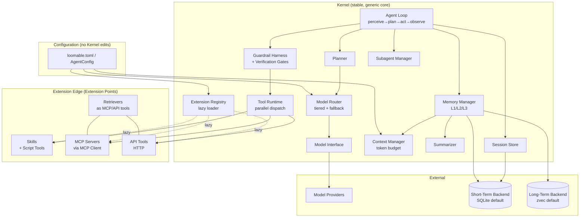
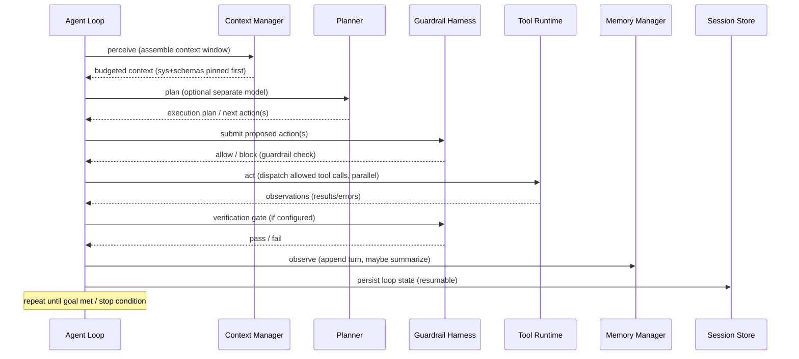

# Design Document: loomable

## Overview

`loomable` is a lightweight, ultra-fast, general-purpose agent framework built on a **kernel + capabilities** model. The central architectural invariant is that the **Kernel** — the generic core that runs the agent loop, manages memory and context, routes model calls, enforces guardrails, and loads extensions — is built once and is never modified to onboard a new use case. All domain behavior enters through exactly two **Extension Points**: Anthropic-style **Skills** (which may bundle script tools) and **MCP servers**, with direct HTTP **API tools** as a first-class tool type available to both.

This design translates the 20 requirements into a concrete Python architecture managed with `uv`. It covers:

- The Kernel and the single-agent `perceive → plan → act → observe` loop with harness-level guardrails and verification gates (Req 18).
- Extension loading: Skills, MCP servers, and API tools, with lazy/on-demand loading (Req 1, 3, 4, 5, 6, 19).
- A model-agnostic model interface with tiered routing and fallback (Req 2, 17).
- A multi-tier Memory Manager (L1/L2/L3) with a Context Manager enforcing a token budget, and checkpoint summarization (Req 9, 10, 11).
- Pluggable short-term (SQLite default) and long-term (zvec default) backends, plus out-of-the-box SQLite session persistence (Req 7, 8, 12).
- Parallel tool calling, subagents, planning with an optional separate model, and retriever/Agentic-RAG integration at the edge (Req 13, 14, 15, 16).

### Design Influences and Research Findings

- **Anthropic-style Skills** are file-system folders anchored by a `SKILL.md` file that carries YAML frontmatter (name, description) plus a Markdown instruction body, and may bundle scripts, templates, and reference docs. The defining principle is **progressive disclosure**: only lightweight metadata is loaded at startup, the full body loads when a task matches, and bundled files load strictly on demand ([Anthropic Agent Skills format guides, 2026](https://www.webfuse.com/agent-skills-cheat-sheet)). loomable adopts this structure verbatim so Skills authored for the Anthropic ecosystem are loadable. Content was rephrased for compliance with licensing restrictions.
- **Lightweight framework precedent (agno):** agno reports microsecond-scale agent instantiation and kilobyte-scale per-agent memory ([agno performance docs](https://docs.agno.com/performance)). loomable's targets (≤50 ms instantiation, ≤15 MB resident per agent — Req 3) are deliberately looser ceilings that still preserve the "instantiate many agents cheaply" property; the primary lever is lazy extension loading and sharing immutable Kernel state across agent instances.
- **Protocol stack (mid-2026):** MCP is the settled standard for agent↔tools; A2A is reserved for later multi-agent scenarios. loomable implements a full MCP client at the tools boundary and does not bake retrieval or domain logic into the Kernel.
- **Memory-as-infrastructure:** production agent failures are predominantly context/memory failures rather than model failures, and retrieval-based memory cuts token usage substantially versus full-history approaches. This motivates the explicit token-budget Context Manager, the L1/L2/L3 tiering, and checkpoint summarization.
- **Prefix caching:** placing static content (system prompt + tool schemas) at the head of the context window enables provider-side prefix caching and lowers time-to-first-token, so the Context Manager pins these items at the front and never evicts them.

## Architecture

### High-Level Structure

loomable is organized as a stable Kernel surrounded by a configuration-driven extension edge. Nothing in the extension edge requires editing Kernel source.



### The Kernel Boundary (Req 1, 19)

The Kernel exposes a closed set of stable abstract interfaces. Onboarding a domain means *supplying implementations/config for the extension edge*, never editing the Kernel. Concretely:

- The Kernel package (`loomable.kernel`) contains only generic orchestration. It declares abstract contracts (`Tool`, `ModelProvider`, `MemoryBackend`, `Retriever`, `Skill`) and never imports a concrete domain module.
- Onboarding requests are expressed as `OnboardingRequest` objects describing the capability and the mechanism (`skill`, `mcp_server`, or `api_tool`). The `ExtensionRegistry.onboard()` method accepts only these three mechanisms. A request whose declared mechanism is `kernel_modification` (or any capability that cannot be expressed through the three supported mechanisms) is rejected with an `UnsupportedExtensionError` that states only Skills, MCP servers, and API tools are supported (Req 1.4, 19.3).
- Extension loading is driven by configuration and performed at runtime (import/subprocess/connection), never by recompiling the Kernel (Req 1.5).

This boundary is what Requirement 19 validates: a representative `Domain_Skill` (shipped under `examples/skills/`) is enabled purely through configuration and exercised by an agent, with a test asserting the Kernel package tree is unchanged and imports no example module.

### Agent Loop (Req 18)

The Kernel runs a single-agent loop. Each iteration is a **step**.



Key harness properties:
- **Guardrails are enforced by the Kernel, not the agent.** They are evaluated in the harness before any tool dispatch; a blocked action is never executed and is recorded (Req 18.2, 18.3).
- **Verification gates** are configurable per step; when present, the loop cannot advance to the next step until the gate passes (Req 18.4).
- **Resumability:** after each step the loop persists a `LoopState` snapshot so an interrupted loop resumes from the last completed step (Req 18.5).

### Concurrency Model (Req 13, 14)

The runtime is `asyncio`-based. Independent tool calls within a single step are dispatched with `asyncio.gather(..., return_exceptions=True)` so that one failure does not cancel siblings; each result (or error) is paired back to its originating `tool_call_id`. Subagents are themselves agent loops run as concurrent tasks under a `SubagentManager`, using the same gather-with-isolation pattern.

## Components and Interfaces

### Extension Registry and Lazy Loading (Req 1, 3)

```python
class ExtensionRegistry:
    def onboard(self, request: OnboardingRequest) -> ExtensionHandle: ...
    #   raises UnsupportedExtensionError if request.mechanism not in
    #   {SKILL, MCP_SERVER, API_TOOL}
    def enabled_extensions(self) -> list[ExtensionSpec]: ...
    def resolve_tool(self, name: str) -> Tool: ...   # triggers lazy load
```

- Only extensions marked `enabled` in configuration are eligible. An extension's expensive resources (Skill body + scripts, MCP connection, HTTP client) are materialized lazily on first use, not at agent instantiation (Req 3.3). This keeps instantiation within the 50 ms / 15 MB budget by deferring work.
- Immutable Kernel data (tool schemas, static system prompt, parsed config) is shared by reference across agent instances so per-agent allocation stays small (Req 3.2).

### Skills Subsystem (Req 5, 19)

```python
@dataclass(frozen=True)
class SkillManifest:
    name: str
    description: str          # used for progressive-disclosure metadata
    body_path: Path           # SKILL.md instruction body
    script_tools: list[ScriptToolSpec]

class SkillLoader:
    def discover(self, roots: list[Path]) -> list[SkillManifest]: ...
    def load(self, manifest: SkillManifest) -> LoadedSkill: ...   # may fail -> SkillLoadError
```

- A Skill is a folder with `SKILL.md` (YAML frontmatter: `name`, `description`; Markdown body of instructions) and optional bundled scripts/resources, matching the Anthropic structure (Req 5.1).
- **Progressive disclosure:** at startup only `name`/`description` metadata is registered; the full body and bundled files load when the Skill is actually engaged.
- Each bundled **Script Tool** is registered as an invocable `Tool`; invocation executes the script in a subprocess and returns its result (Req 5.2, 5.3). Execution failure returns a `ScriptToolError` naming the tool (Req 5.5).
- Skill loading is isolated: a failing Skill produces a `SkillLoadError` naming the Skill and loading continues for the remaining Skills (Req 5.4).

### MCP Client (Req 4, 16)

```python
class MCPClient:
    async def connect(self, spec: MCPServerSpec) -> MCPSession: ...   # -> MCPConnectionError
    async def list_capabilities(self, session: MCPSession) -> MCPCapabilities: ...
    async def call_tool(self, session, name, args) -> ToolResult: ...  # -> MCPToolError
```

- Implements the Model Context Protocol at the agent↔tools boundary (Req 4.1). On connect, it enumerates exposed tools and data resources (Req 4.2).
- Connection failures are isolated: a failed server yields an `MCPConnectionError` naming that server; other configured servers keep operating (Req 4.4).
- Tool invocation errors are surfaced to the agent naming the failed tool (Req 4.5). Retrievers are wired in purely as MCP (or API) tools with no Kernel change (Req 16.1, 16.4).

### API Tool Runtime (Req 6, 16)

```python
class APITool(Tool):
    spec: APIToolSpec       # method, url template, headers, timeout
    async def invoke(self, args) -> ToolResult: ...
```

- Sends the configured HTTP request and returns the service response (Req 6.2).
- Non-success HTTP status → `APIToolError` including the status code (Req 6.3).
- Exceeding the configured timeout → request cancelled, `APIToolTimeoutError` returned (Req 6.4).

### Tool Runtime and Parallel Dispatch (Req 13)

```python
class ToolRuntime:
    async def dispatch(self, calls: list[ToolCall]) -> list[ToolOutcome]:
        # concurrent execution; each ToolOutcome carries the originating
        # tool_call_id and either a result or an isolated error
```

Independent calls run concurrently; results are matched to their originating call id; a single failure is reported for that call while successful calls still return results (Req 13.1–13.3).

### Model Interface and Router (Req 2, 17)

```python
class ModelProvider(Protocol):
    async def complete(self, request: ModelRequest) -> ModelResponse: ...

class ModelInterface:
    async def invoke(self, request: ModelRequest, tier: str | None = None) -> ModelResponse: ...

class ModelRouter:
    def select_tier(self, request: ModelRequest) -> str: ...       # cost/latency policy
    def fallback(self, tier: str) -> str | None: ...
```

- `ModelRequest`/`ModelResponse` are a single provider-agnostic shape; agents never contain provider-specific code (Req 2.1, 2.2). Swapping the configured provider requires no agent changes (Req 2.3). An unavailable provider yields a `ModelProviderError` naming it (Req 2.4).
- With tiered routing configured, the router picks a tier per call by policy (Req 17.1) and routes through the Model Interface (Req 17.2). If the selected tier is unavailable, it selects a configured fallback tier and records the substitution in a `TierSubstitution` record (Req 17.3).

### Planner (Req 15)

```python
class Planner:
    async def plan(self, task: TaskContext) -> ExecutionPlan: ...
```

- Produces an execution plan for the task (Req 15.1). If a `Planning_Model` is configured, it is used for plan generation; otherwise the agent's primary model is used (Req 15.2, 15.3). An unavailable planning model yields a `PlanningModelError` naming it (Req 15.4).

### Memory Manager, Context Manager, Summarizer (Req 9, 10, 11)

```python
class MemoryManager:
    l1: list[Turn]                       # raw recent turns
    l2: list[StructuredSummary]          # compressed summaries/entities
    l3: LongTermStore                    # vector episodic memory
    def record_turn(self, turn: Turn) -> None: ...
    async def recall(self, query: str, k: int) -> list[EpisodicItem]: ...  # L3, ranked

class ContextManager:
    token_budget: int
    def assemble(self) -> ContextWindow: ...          # sys+schemas pinned first
    def admit(self, item: ContextItem) -> AdmissionResult: ...   # evict-then-admit
    def current_tokens(self) -> int: ...

class Summarizer:
    checkpoint_interval: int
    async def summarize(self, turns: list[Turn]) -> StructuredSummary: ...
```

- **Token budget accounting:** the Context Manager tracks live token count against `Token_Budget` and updates it on every admission (Req 9.1, 9.2).
- **Evict-then-admit:** if admitting an item would exceed the budget, lower-priority items are evicted until count ≤ budget *before* admitting; system prompt and tool schemas are never evicted and are placed first (Req 9.3, 9.4, 9.5).
- **Tiering:** L1 raw turns, L2 compressed summaries/entities, L3 vector episodic; `recall` returns similarity-ranked L3 items (Req 11.1–11.4).
- **Checkpoint summarization:** every `Checkpoint_Interval` steps, the Summarizer compresses accumulated history into a `StructuredSummary` that preserves task objectives and decisions; it is stored as L2, and the covered raw turns are replaced by the summary in the context window (Req 10.1–10.4).

### Short-Term, Long-Term, and Session Stores (Req 7, 8, 12)

```python
class MemoryBackend(Protocol): ...           # pluggable
class ShortTermStore:  backend: MemoryBackend      # SQLite default
class LongTermStore:   backend: VectorBackend      # zvec default
class SessionStore:    # SQLite by default, no extra config
    def save(self, session: Session) -> None: ...
    def resume(self, session_id: str) -> Session: ...   # -> SessionNotFoundError
```

- Short-term store persists recent conversational/session state via a pluggable RDBMS backend defaulting to SQLite; writes persist and reads return persisted state; alternative backends require no agent changes; unavailable backend errors name the backend (Req 7).
- Long-term store indexes items in a pluggable vector backend defaulting to zvec; queries return similarity-ranked items; alternative backends require no agent changes; unavailable backend errors name the backend (Req 8).
- Session store persists sessions on SQLite out of the box, restores by id on resume, and returns a `SessionNotFoundError` naming the id when missing (Req 12).

### Subagents (Req 14)

```python
class SubagentManager:
    async def spawn(self, task: DelegatedTask) -> AgentHandle: ...
    async def run_all(self, tasks: list[DelegatedTask]) -> list[SubagentOutcome]: ...
```

A parent delegates a unit of work; the Kernel instantiates a subagent loop to perform it and returns the result to the parent. Independent subagents run concurrently; a subagent failure is returned to the parent naming the failed subagent (Req 14.1–14.4).

## Data Models

```python
# --- Configuration ---
@dataclass(frozen=True)
class AgentConfig:
    model: ModelProviderSpec
    planning_model: ModelProviderSpec | None
    tiers: dict[str, ModelProviderSpec]            # tiered routing
    tier_policy: TierPolicy | None
    fallback_tiers: dict[str, str]
    token_budget: int
    checkpoint_interval: int
    short_term: BackendSpec = SQLITE_DEFAULT
    long_term: BackendSpec = ZVEC_DEFAULT
    skills: list[SkillSpec]
    mcp_servers: list[MCPServerSpec]
    api_tools: list[APIToolSpec]
    guardrails: list[GuardrailRule]
    verification_gates: dict[int, GateSpec]

# --- Onboarding / extension model ---
class ExtensionMechanism(Enum):
    SKILL = "skill"; MCP_SERVER = "mcp_server"; API_TOOL = "api_tool"
    KERNEL_MODIFICATION = "kernel_modification"   # always rejected

@dataclass
class OnboardingRequest:
    capability: str
    mechanism: ExtensionMechanism

# --- Tools ---
@dataclass
class ToolCall:      id: str; tool_name: str; args: dict
@dataclass
class ToolOutcome:   call_id: str; result: ToolResult | None; error: ToolError | None

# --- Memory / context ---
@dataclass
class Turn:              role: str; content: str; tokens: int; step: int
@dataclass
class StructuredSummary: covers_steps: range; objectives: list[str]; decisions: list[str]; text: str; tokens: int
@dataclass
class ContextItem:       kind: Literal["system","schema","turn","summary","recall"]; tokens: int; priority: int; pinned: bool
@dataclass
class ContextWindow:     items: list[ContextItem]   # index 0..n = system, schemas, then rest

# --- Session / loop ---
@dataclass
class Session:    session_id: str; agent_config_ref: str; l1: list[Turn]; l2: list[StructuredSummary]; step: int
@dataclass
class LoopState:  session_id: str; step: int; phase: Literal["perceive","plan","act","observe"]; pending: list[ToolCall]
```

**Invariants encoded in the models:**
- `ContextManager.current_tokens() <= token_budget` after every completed admission.
- `pinned == True` for all `kind in {"system","schema"}` items, and pinned items are never evicted and occupy the lowest indices.
- Every `ToolOutcome` has exactly one of `result`/`error` set, and its `call_id` matches an issued `ToolCall.id`.

## Correctness Properties

*A property is a characteristic or behavior that should hold true across all valid executions of a system — essentially, a formal statement about what the system should do. Properties serve as the bridge between human-readable specifications and machine-verifiable correctness guarantees.*

The following properties were derived from the acceptance criteria prework and consolidated to remove redundancy (error-identity criteria merged into one naming property plus an HTTP-status variant; fault-isolation criteria merged into one property; ranking and round-trip families merged as noted). Each property is universally quantified and is intended to be implemented as a single property-based test running at least 100 iterations.

### Property 1: Onboarding accepts supported mechanisms and rejects everything else

*For any* `OnboardingRequest`, onboarding SHALL succeed and return an extension handle when the request's mechanism is one of {Skill, MCP server, API tool}, and SHALL be rejected with an error naming the supported mechanisms otherwise (including any request that would require Kernel modification).

**Validates: Requirements 1.2, 1.4, 19.3**

### Property 2: Disabled extensions are never materialized

*For any* configuration assigning an enabled/disabled flag to each extension, after agent instantiation SHALL every disabled Skill remain unloaded and every disabled MCP server remain unconnected (their load/connect side effects never occur), while enabled extensions materialize only on first use.

**Validates: Requirements 3.3, 1.5**

### Property 3: Provider-agnostic invocation

*For any* configured model provider drawn from a set of interchangeable providers, invoking the agent through the Model Interface with identical agent logic SHALL return a well-formed `ModelResponse` for the same `ModelRequest` shape.

**Validates: Requirements 2.1, 2.2, 2.3**

### Property 4: Errors identify the responsible component

*For any* framework surface that fails or is unavailable — a model provider, an MCP tool, a script tool, a short-term or vector memory backend, a planning model, a retriever, or a resumed session id — the returned error SHALL name the specific responsible component (provider id, tool name, backend id, model id, retriever name, or session id).

**Validates: Requirements 2.4, 4.5, 5.5, 7.6, 8.6, 12.4, 15.4, 16.5**

### Property 5: HTTP API errors include the status code

*For any* non-success HTTP status code returned by an API tool's target service, the error returned to the Agent SHALL include that HTTP status code.

**Validates: Requirements 6.3**

### Property 6: Fault isolation across independent units

*For any* collection of independent units (configured MCP servers, configured Skills, concurrent tool calls, or delegated subagents) in which an arbitrary subset is designated to fail, processing the collection SHALL return a failure for exactly each failing unit (naming it) and SHALL still return successful outcomes for every non-failing unit.

**Validates: Requirements 4.4, 5.4, 13.3, 14.4**

### Property 7: Tool invocation round-trips the payload

*For any* tool-call payload sent to an MCP tool, an API tool, or a retriever tool backed by an echo service, the outcome returned to the Agent SHALL carry content derived from that payload (the request reaches the tool and its response is returned).

**Validates: Requirements 4.3, 6.2, 16.2**

### Property 8: Script tools are loaded and invocable

*For any* well-formed Anthropic-style Skill bundling a set of script tools, loading the Skill SHALL expose its name, description, and body, and SHALL register every bundled script tool as an invocable tool whose invocation returns a result reflecting its input arguments.

**Validates: Requirements 5.1, 5.2, 5.3**

### Property 9: Short-term memory write/read round-trip

*For any* short-term state and *for any* conforming RDBMS backend, writing the state and then reading it back SHALL return a value equal to the state written.

**Validates: Requirements 7.1, 7.3, 7.4, 7.5**

### Property 10: Long-term recall is ranked by similarity

*For any* set of stored episodic items and *for any* query, querying long-term memory SHALL return items ordered by non-increasing similarity to the query, and when an item equal to the query is present it SHALL be ranked first; this holds across any conforming vector backend.

**Validates: Requirements 8.1, 8.3, 8.4, 8.5, 11.3, 11.4**

### Property 11: Context token budget and pinning invariant

*For any* token budget and *for any* stream of context items with assigned priorities and token sizes, after every admission the tracked token count SHALL equal the sum of the tokens of currently retained items and SHALL be at or below the budget, evictions SHALL remove lowest-priority non-pinned items first, and pinned system-prompt and tool-schema items SHALL never be evicted.

**Validates: Requirements 9.1, 9.2, 9.3, 9.4, 11.1**

### Property 12: Static content is placed at the head of the window

*For any* context state, the window produced by `assemble()` SHALL begin with exactly the pinned system-prompt and tool-schema items, in order, before any conversational or recalled item.

**Validates: Requirements 9.5**

### Property 13: Checkpoint summarization triggers on interval and compresses covered turns

*For any* checkpoint interval K and *for any* step count n, a summarization SHALL occur exactly when n is a positive multiple of K, the produced structured summary SHALL be stored as L2 content, and after summarization the context window SHALL contain the summary, SHALL contain none of the raw turns it covers, and SHALL have a token count no greater than before summarization.

**Validates: Requirements 10.1, 10.2, 10.3, 11.2**

### Property 14: Session persistence round-trip

*For any* Agent session, saving it and then resuming by its session identifier SHALL restore a session equal to the one saved.

**Validates: Requirements 12.1, 12.2, 12.3**

### Property 15: Concurrent execution completes all units with overlap

*For any* set of independent tool calls or subagent tasks instrumented with artificial delays, dispatching them SHALL return an outcome for every unit and the total wall-clock time SHALL be less than the sum of the individual delays (demonstrating concurrent, not serial, execution).

**Validates: Requirements 13.1, 14.3**

### Property 16: Results are matched to their originating calls

*For any* set of tool calls with distinct identifiers, dispatch SHALL return exactly one outcome per identifier, and each outcome SHALL carry the identifier and payload of the call it originated from (a bijection between calls and outcomes).

**Validates: Requirements 13.2**

### Property 17: Subagent delegation returns each result to the parent

*For any* set of delegated tasks, running them SHALL return to the parent exactly one outcome per task carrying that subagent's result, keyed to the originating task.

**Validates: Requirements 14.1, 14.2**

### Property 18: Planner model selection

*For any* planning configuration, the Planner SHALL produce a well-formed execution plan, invoking the separately configured planning model when one is configured and the primary model otherwise.

**Validates: Requirements 15.1, 15.2, 15.3**

### Property 19: Tier selection and fallback

*For any* model call under a configured tier policy, the Model Router SHALL select a tier present in the configured tiers; and *for any* selected tier that is unavailable but has a configured fallback, the call SHALL route to the fallback tier and a tier-substitution record naming both the intended and fallback tiers SHALL be produced.

**Validates: Requirements 17.1, 17.2, 17.3**

### Property 20: Loop phase ordering

*For any* number of executed steps, the recorded phase trace of the agent loop SHALL be a whole-number repetition of the sequence [perceive, plan, act, observe] in that order.

**Validates: Requirements 18.1**

### Property 21: Guardrails block and record violating actions

*For any* set of proposed actions and configured guardrail rules, every action that violates a rule SHALL be absent from the set of dispatched actions and present in the blocked-actions record, while every non-violating action SHALL be dispatched.

**Validates: Requirements 18.2, 18.3**

### Property 22: Verification gate blocks advancement on failure

*For any* step with a configured verification gate, the loop SHALL advance to the next step if and only if the gate passes.

**Validates: Requirements 18.4**

### Property 23: Loop state round-trip enables resumption

*For any* `LoopState`, persisting it and then restoring it SHALL yield an equal state, and resumption SHALL continue from the recorded step and phase.

**Validates: Requirements 18.5**

## Error Handling

loomable follows a consistent, component-naming error strategy so that every failure is attributable and isolated (the basis of Properties 4 and 6).

### Error Taxonomy

| Error | Raised when | Carries |
|---|---|---|
| `UnsupportedExtensionError` | Onboarding via an unsupported mechanism (Req 1.4, 19.3) | supported-mechanism list |
| `ModelProviderError` | Configured provider unavailable (Req 2.4) | provider id |
| `MCPConnectionError` | MCP server connection fails (Req 4.4) | server id |
| `MCPToolError` | MCP tool invocation returns error (Req 4.5) | tool name |
| `SkillLoadError` | Skill fails to load (Req 5.4) | skill name |
| `ScriptToolError` | Script tool execution fails (Req 5.5) | tool name |
| `APIToolError` | API tool returns non-2xx (Req 6.3) | HTTP status code |
| `APIToolTimeoutError` | API tool exceeds timeout (Req 6.4) | tool name, timeout |
| `MemoryBackendError` | Short-term/vector backend unavailable (Req 7.6, 8.6) | backend id |
| `SessionNotFoundError` | Resume of unknown session id (Req 12.4) | session id |
| `PlanningModelError` | Planning model unavailable (Req 15.4) | model id |
| `SubagentError` | Subagent fails (Req 14.4) | subagent id |
| `GuardrailViolation` | Action violates a guardrail (Req 18.3) | rule id, action |

### Isolation Principles

- **Per-unit isolation.** Loaders and dispatchers process independent units (Skills, MCP servers, tool calls, subagents) with per-unit `try/except`, collecting outcomes rather than aborting the batch. Concurrency uses `asyncio.gather(..., return_exceptions=True)` and re-attaches exceptions to their originating unit id.
- **Guardrails fail closed.** A guardrail-violating action is never dispatched; it is recorded and the loop is offered a safe continuation.
- **Budget safety.** The Context Manager never admits an item that would leave the window over budget; if space cannot be freed without evicting pinned items, admission of the offending non-pinned item is refused rather than dropping system/schema content.
- **Resumability.** Loop state is persisted after each step; an interrupted run resumes from the last persisted `LoopState` (Req 18.5).

## Testing Strategy

### Dual Approach

- **Property-based tests** verify the 23 universal properties above across generated inputs. PBT is well-suited here because the Kernel is dominated by pure/deterministic logic — token accounting, eviction ordering, ranking, round-trip persistence, tier selection, result-to-call matching, and error-identity — where input variation reveals edge cases.
- **Unit / example tests** cover concrete scenarios and defaults: SQLite is the default short-term backend (Req 7.2), zvec is the default long-term backend (Req 8.2), the registry advertises exactly two extension points (Req 1.1), a summary preserves scripted objectives/decisions (Req 10.4), and an example Domain_Skill is enabled purely via config with the Kernel package importing no example module (Req 19.1, 19.2).
- **Integration tests** cover the MCP boundary against a reference/mock MCP server (Req 4.1, 4.2) and config-driven loading without recompilation (Req 1.5).
- **Smoke / benchmark tests** cover the performance ceilings (≤50 ms instantiation, ≤15 MB resident — Req 3.1, 3.2) and the stack facts (Python, uv — Req 20.1, 20.2). These are one-shot checks, not PBT.
- **Edge-case tests** cover the API-tool timeout path with a controlled server delay (Req 6.4).

### Property-Based Testing Configuration

- **Library:** `hypothesis` (the standard PBT library for Python). Async properties use `pytest-asyncio`; do not implement PBT machinery by hand.
- **Iterations:** each property test runs a minimum of 100 examples (`@settings(max_examples=100)` or higher).
- **Generators:** custom Hypothesis strategies for `ContextItem` streams (priorities, token sizes, pinned flags), `Turn`/`Session`/`LoopState` values, tool-call/subagent collections with random failing subsets, provider/tier/backend id sets, SKILL.md manifests with bundled script-tool specs, and episodic item sets with query vectors.
- **Tagging:** each property test is tagged with a comment referencing its design property in the format:
  `# Feature: loomable, Property {number}: {property_text}`
- **Mocks over real I/O:** model providers, MCP servers, HTTP endpoints, and vector backends are mocked in property tests to keep 100+ iterations cheap; real-service behavior is confined to the integration suite.
- **Coverage mapping:** every property test references the requirement(s) it validates via the property number, giving traceability from requirements → properties → tests.

### Tooling

The project is Python, managed with `uv` (Req 20). Tests run via `uv run pytest`. Suggested layout: `tests/properties/` (Hypothesis property tests), `tests/unit/`, `tests/integration/`, and `tests/benchmarks/` (instantiation/memory smoke checks). Run the suite once with `uv run pytest` rather than in watch mode.
